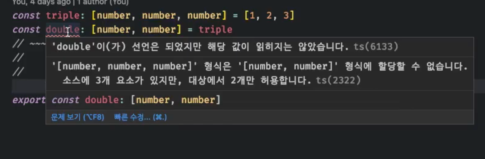

# Item 4 ~ Item 7

code 출처: [https://github.com/danvk/effective-typescript/tree/master/samples/ch01-intro/item-04-structural](https://github.com/danvk/effective-typescript/tree/master/samples/ch01-intro/item-04-structural)

## Item 4 구조적 타이핑에 익숙해지기(**Get Comfortable with Structural Typing)**

Example**1**

```jsx
interface Vector2D {
  x: number
  y: number
}
function calculateLength(v: Vector2D) {
  return Math.sqrt(v.x * v.x + v.y * v.y)
}
interface NamedVector {
  name: string
  x: number
  y: number
}
const v: NamedVector = { x: 3, y: 4, name: 'Zee' } // <- Vector2D와 상관없는 name이 추가됨
calculateLength(v) // OK, result is 5
```

```jsx
interface NamedVector extends Vector2D{
  name: string
}
```

Vector2D와 NamedVector 관계를 extends로 선언하지 않았지만 구조적 타이핑으로 호환이 가능하다.

왜? 자바스크립트는 덕 타이핑 기반이고 타입스크립트가 이를 모델링하기 위해 구조적 타이핑을 사용함. 

구조적타이핑 규칙은 어떠한 값이 다른 속성을 가질 수 있다.

JavaScript is duck typed and TypeScript uses structural typing to model.

values assignable to your interfaces might have properties beyond those explicitly listed in your type declarations.

Example2

```jsx
interface Vector2D {
  x: number
  y: number
}

function calculateLength(v: Vector2D) {
  return Math.sqrt(v.x * v.x + v.y * v.y)
}

interface Vector3D {
  x: number
  y: number
  z: number
}

function normalize(v: Vector3D) {
  const length = calculateLength(v) // (v.x^2 + v.y^2 + v.z^2)
  return {
    x: v.x / length,
    y: v.y / length,
    z: v.z / length,
  }
}

normalize({x:3, y:4, z: 5})
```

v.z^2까지 필요한데 `calculateLength(v: Vector2D)` 여기서 에러가 발생하지 않음

타입스크립트 타입 시스템은 좋든 싫든 열려(Open)있다. 

Types are not “sealed.”

Example**3**

```jsx
interface Vector3D {
  x: number
  y: number
  z: number
}
function calculateLengthL1(v: Vector3D) {
  let length = 0
  for (const axis of Object.keys(v)) {
    const coord = v[axis]
    // ~~~~~~~ Element implicitly has an 'any' type because ...
    //         'string' can't be used to index type 'Vector3D'
    length += Math.abs(coord)
  }
  return length
}
const vec3D = { x: 3, y: 4, z: 1, address: '123 Broadway' } // <- address?? 
calculateLengthL1(vec3D) // OK, returns N
```


[TS Playground - An online editor for exploring TypeScript and JavaScript](https://www.typescriptlang.org/play?#code/JYOwLgpgTgZghgYwgAgGoQWA9lATAEWQG8BYAKGWQA8AuZEAVwFsAjacygTzsdfbIC+5GAxCZgWEMgRwANggay4kADIQQAczAALABQA3Oukw4CASmIdkUCGAZQpAWWXaAdAGcAjlDAHXVZAAqZH1-ZABqENdOIKjOM3IhMlBIWEQUADk4JggAE2NsKEsKemyIOncwKFANK1p6ZjYoK24GvmbBchToeCQ0DEKAZkJSEvreJpaeRv5KAC9p9sThUXFJaTkFJVV1LW0VAEYDIwGcYYtRyllbZGvNHWQAXmQABisYHGRdBElK5DgqMB3MgsDBkAB5FgAKwGrgA1hBOO4DGYLlZKD8QH8fjhck8QgBtAFAgC66OQAHoKcgAH50+k05AAUWuOXAyGATAADrJgAhgGBZDFtHBgXApABycWcCXIMCcLkoNgyBjuFCuDXkqmUHW6iWVaqaWUyEASsDINjIVV5OVYDkgXIQALyxXICUFM74CXku57CLPZw6VxwFjInFQXIJEpJSg2OwOW67HTLMjkJ1cnDmx3wRTmogCIA)

Example**4**

```jsx
class C {
  foo: string
  constructor(foo: string) {
    this.foo = foo
  }
  abc() {}
}

const c = new C('instance of C') // <- 값으로 사용
const d: C = { foo: 'object literal', abc(){} } // OK! <- 타입으로 사용

console.log(d instanceof C) // false
```

구조적 타이핑 규칙을 따르기 때문에 클래스의 인스턴스가 예상과 다를 수 있다. 

Be aware that classes also follow structural typing rules. You may not have an instance of the class you expect

Example**5**

```jsx
interface PostgresDB {
  runQuery: (sql: string) => any[]
  ...
}

interface Author {
  first: string
  last: string
}
interface DB {
  runQuery: (sql: string) => any[]
}
function getAuthors(database: DB): Author[] {
  const authorRows = database.runQuery(`SELECT FIRST, LAST FROM AUTHORS`)
  return authorRows.map(row => ({ first: row[0], last: row[1] }))
}

export default {}
```

PostgresDB를 명확히 선언할 필요가 없다. 

테스트 코드를 짤때 실제 환경의 데이터베이스에 대한 정보가 불필요하기 때문에 의존성을 완벽히 분리할 수 있다.

## Item5 any 타입 지양하기(**Limit Use of the any Type)**

- any타입에는 타입 안정성이 없다.
- any는 함수의 입출력을 어길 수 있다.
- 자동완성 기능과 도움말 제공을 받을 수 없다.
- 리팩토링 버그를 감춘다.
- 타입설계를 일일이 작성할 필요없이 간단히 끝낼 수 있다. → 객체에서 문제가 생길 수 있다.
- 런타임에 발견될 오류를 미리 잡기가 어렵다.

## Item6 편집기를 사용하여 타입 시스템 탐색하기(**Use Your Editor to Interrogate and Explore the Type System)**

편집기에서 타입스크립트 언어 서비스를 적극 활용하자. 

라이브러리를 탐색할 때도 도움이 된다.

null은 타입이 object이니 조심하자

## Item7 타입이 값들의 집합(범위)이라고 생각하기(**Think of Types as Sets of Values)**

### never

```jsx
const x: never = 12;
// ~ '12'형식은 'never' 형식에 할당할 수 없습니다.
// ~ Type '12' is not assignable to type 'never' 
```

아무 값도 포함할 수 없는 공집합이며, 가장 작은 집합이다. 아무런 값도 할당할 수 없다. 

### Literal type(Unit type)

```jsx
type A = 'A';
type B = 'B';
type C = 12;
```

원소가 1개만 있는 집합

### Union type

```jsx
type AB = 'A' | 'B'; // A도 될 수 있고 B도 될 수 있다 -> 합집합
type AB12 = 'A' | 'B' | 12;

const a: AB = 'A'; // <- 부분집합이 맞는가? 
const c: AB = 'C';
```

값 집합들의 합집합이다.

타입체커는 하나의 집합이 다른 집합의 부분 집합인지를 검사하는 것이라고 볼 수 있다.

## & 연산자

```tsx
interface Person {
  name: string
}
interface Lifespan {
  birth: Date
  death?: Date
}
type PersonSpan = Person & Lifespan
const ps: PersonSpan = {
  name: 'Alan Turing',
  birth: new Date('1912/06/23'),
  death: new Date('1954/06/07'),
} // OK
```

& 연산자는 두 타입의 인터섹션(intersection, 교집합)을 계산한다. 

never로 예상할 수 있지만 인터페이스의 속성이 아닌 값의 집합(타입의 범위)에 적용된다.

Person 과 Lifespan의 교집합은 Person범위와 Lifespan범위의 교집합니다. 

객체타입에서는 Person & Lifespan인 값이 Person 과 Lifespan의 속성을 모두 가짐을 의미한다.

## keyof

```jsx
interface Identified {
  id: string
}
interface Person {
  name: string
}
interface Lifespan {
  birth: Date
  death?: Date
}

type PersonSpan = Person & Lifespan

type K = keyof (Person | Lifespan) // Type is never

keyof (A&B) = (keyof A) | (keyof B)
keyof (A|B) = (keyof A) & (keyof B) // Type is never
```

???  드모르간의 법칙?? 

## extends keyword

```jsx
interface Vector1D {
  x: number
}
interface Vector2D extends Vector1D {
  y: number
}
interface Vector3D extends Vector2D {
  z: number
}
```


([출처](https://javascript.plainenglish.io/effective-typescript-62-specific-ways-to-improve-your-typescript-5a9462ed260a))

extends 키워드는 `~의 부분집합` 을 의미하기도 한다. typescript는 교집합 원소가 1개만 있는 집합등 엄격한 계층 구조가 아니기 때문에 상속의 관점보다 집합의 관점으로 바라보는 것이 바람직하다. 

```tsx
interface Point {
  x: number
  y: number
}
type PointKeys = keyof Point // Type is "x" | "y"

function sortBy<K extends keyof T, T>(vals: T[], key: K): T[] {
  // COMPRESS
  vals.sort((a, b) => (a[key] === b[key] ? 0 : a[key] < b[key] ? -1 : +1))
  return vals
  // END
}

const pts: Point[] = [
  { x: 1, y: 1 },
  { x: 2, y: 0 },
]

sortBy(pts, 'x') // OK, 'x' extends 'x'|'y' (aka keyof T)
sortBy(pts, 'y') // OK, 'y' extends 'x'|'y'
sortBy(pts, Math.random() < 0.5 ? 'x' : 'y') // OK, 'x'|'y' extends 'x'|'y'
sortBy(pts, 'z')
// ~~~ Type '"z"' is not assignable to parameter of type '"x" | "y"

export default {}
```

keyof T는 type PointKeys = keyof Point 

extends 키워드는 `~의 부분집합`

A는 B를 상속, A는 B에 할당 가능, A는 B의 서브타입은 A는 B의 부분 집합과 같은 의미이다.

## tuple, triple

```tsx
const triple: [number, number, number] = [1, 2, 3]
const double: [number, number] = triple
// ~~~~~~ '[number, number, number]' is not assignable to '[number, number]'
//          Types of property 'length' are incompatible
//          Type '3' is not assignable to type '2'

export default {}
```




{0: number, 1: number, 3:number, length:3}

## Exclude

```tsx
type Exclude<T, U> = T extends U ? never : T; // T가 U의 부분집합이라면 never

type T = Exclude<string | Date, string | number> // Type is Date

type NonZeroNums = Exclude<number, 0> // Type is still just number
```


| 타입스크립트 용어 | 집합 용어 |
| --- | --- |
| never | Ø 공집합 |
| 리터럴 타입 | 원소가 1개인 집합 |
| 값이 T에 할당 가능 | 값 ∈ T (값이 T의 원소) |
| T1이 T2에 할당 가능 | T1 ⊂ T2 (T1이 T2의 부분집합) |
| T1이 T2를 상속 | T1 ⊂ T2 (T1이 T2의 부분집합) |
| T1 | T2 (T1과 T2의 유니온) | T1 ∪ T2 (T1과 T2의 합집합) |
| T1 & T2 (T1과 T2의 인터섹션) | T1 ∩ T2 (T1과 T2의 교집합) |
| unknown | 전체(universal) 집합 |