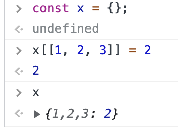
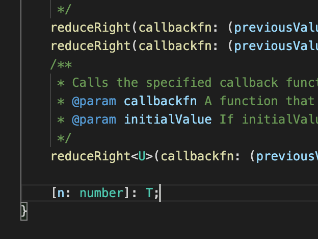
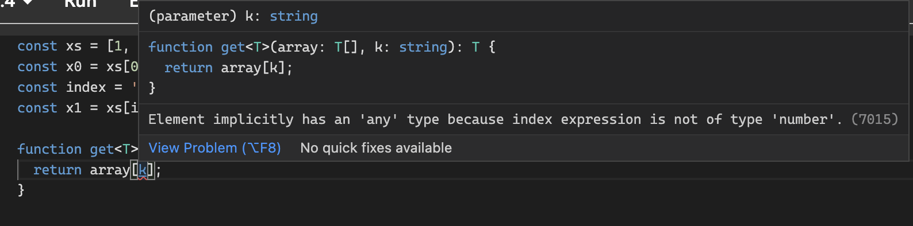
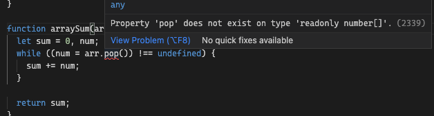

# Item14 ~ Item18

## Item 14 / 타입 연산과 제너릭 사용으로 반복 줄이기

---

**<코드에서 중복 제거하기>**

- 아래는 원기둥 (cylinder) 의 반지름과 높이, 표면적, 부피를 출력하는 코드

```tsx
console.log('Cylinder 1 x 1 ',
  'Surface area:', 6.283185 * 1 * 1 + 6.283185 * 1 * 1,
  'volume:', 3.14159 * 1 * 1 * 1);

console.log('Cylinder 1 x 2 ',
  'Surface area:', 6.283185 * 1 * 1 + 6.283185 * 2 * 1,
  'volume:', 3.14159 * 1 * 1 * 1);

console.log('Cylinder 2 x 1 ',
  'Surface area:', 6.283185 * 2 * 1 + 6.283185 * 2 * 1,
  'volume:', 3.14159 * 2 * 2 * 1);
```

- 비슷한 코드가 반복되어 있어 보기 불편하고, 값과 상수가 반복되는 바람에 
드러나지 않는 오류도 있습니다.
이 코드에서 함수, 상수, 루프의 반복을 제거해 코드를 개선해보겠습니다.

```tsx
const surfaceArea = (r, h) => 2 * Math.PI * r * (r + i);
const volume = (r, h) => Math.PI * r * r * h;
for (const [r, h] of [[1, 1], [1, 2], [2, 1]]) {
  console.log(
    `Cylinder ${r} x ${h}`,
    `Surface area: ${surfaceArea(r, h)}`,
    `Volume: ${volume(r, h)}`
  )
}
```

- 같은 코드를 반복하지 말라는 DRY(don’t repeat yourself) 원칙입니다.
반복된 코드를 열심히 제거하며 DRY 원칙을 지켜온 개발자라도 타입에 대해서는 간과 했을지 모릅니다.

**<중복된 타입 제거하기>**

```tsx
interface Person {
  firstName: string;
  lastName: string;
}

interface PersonWIthBirthDate {
  firstName: string; // 중복
  lastName: string; // 중복
  birth: Date;
}
```

- 타입 중복은 코드 중복만큼 많은 문제를 발생 시킵니다. 
예를 들어 선택적 필드인 middleName 을 Person 에 추가한다고 가정해 보겠습니다.
그러면 Person 과 PersonWithBirthDate 는 다른 타입이 됩니다.
- 타입에서 중복이 더 흔한 이유 중 하나는 공유된 패턴을 제거하는 매커니즘이 기존 코드에서 하던 것과
비교해 덜 익숙하기 때문입니다.
- 타입 간에 매핑하는 방법을 익히면, 타입 정의에서도 DRY 의 장점을 적용할 수 있습니다.

- 반복을 줄이는 가장 간단한 방법은 타입에 이름을 붙이는 것입니다.

```tsx
// {x: number, y: number} 이 반복되어 사용된다.
function distance(a: {x: number, y: number}, b: {x: number, y: number}) {
  return Math.sqrt(Math.pow(a.x - b.x, 2) + Math.pow(a.y - b.y), 2);
}
```

- 코드를 수정해 위에서 언급한 타입에 이름을 붙이는 것으로 중복을 해결해보겠습니다.

```tsx
interface Point2D {
  x: number;
  y: number;
}

function distance(a: Point2D, y: Point2D) {
  return Math.sqrt(Math.pow(a.x - b.x, 2) + Math.pow(a.y - b.y), 2);
}
```

- 이 코드는 상수를 사용해서 반복을 줄이는 기법을 동일하게 타입 시스템에 적용한 것입니다.
중복된 타입 찾기가 항상 쉬운 것은 아닙니다.
이는 종종 문법에 의해서 가려지기도 합니다. 예를 들어, 몇몇 함수가 같은 타입 시그니처를 공유하고
있다고 해보겠습니다.

```tsx
function get(url: string, opts: Options): Promise<Response> { /** */ }
function post(url: string, opts: Options): Promise<Response> { /** */ }
```

- 이를 명명된 타입으로 분리할 수 있습니다. (명명된 타입은 아이템 12에서 다뤘습니다.)

```tsx
type HTTPFunction = (url: string, opts: Options) => Promise<Response>;
const get: HTTPFunction = (url, opts) => { /** */ }
const post: HTTPFunction = (url, opts) => { /** */ }
```

- 처음 예시였던 Person / PersonWithBirthDate 예제에서는 한 인터페이스가 다른 인터페이스를
확장하게 해서 반복을 제거할 수 있습니다.

```tsx
interface Person {
  firstName: string;
  lastName: string;
}

interface PersonWithBirthDate extends Person {
  birth: Date;
}
```

- 이미 존재하는 타입을 확장하는 경우에, 일반적이지는 않지만 인터섹션 연산자 (&) 을 사용할 수 있습니다.
아래 방식은 유니온 타입(확장할 수 없는) 에 속성을 추가하려고 할 때 특히 유용합니다.
([item 13(타입과 인터페이스의 차이](item11%20~%20item13%2037bc83bdcc924acda04966e1db81b6c6.md)) 72p 에서 예시 있습니당)

```tsx
type PersonWithBirthDate = Person & { birth: Date };
```

- 전체 애플리케이션의 상태를 표현하는 State type 과 부분만 표현하는 TopNavState 가 있는 경우를
살펴보겠습니다.

```tsx
interface State {
  userId: string;
  pageTitle: string;
  recentFiles: string[];
  pageContents: string;
}

interface TopNavState {
  userId: string;
  pageTitle: string;
  recentFiles: string[];
}
```

- TopNavState 를 확장하여 State 를 구성하기보다, 
State 의 부분 집합으로 TopNavState 를 정의하는 것이 바람직해 보입니다.
(State 의 일부 즉 부분 집합이 TopNavState 이므로)

### <중복을 제거하는 방법>

1. **State 를 인덱싱하여 속성의 타입에서 중복을 제거할 수 있습니다.**

```tsx
type TopNavState = {
  userId: State['userId'];
  pageTitle: State['pageTitle'];
  recentFiles: State['recentFiles'];
};
```

- State 내의 pageTitle 의 타입이 바뀌면 TopNavState 에도 반영됩니다.
여전히 반복되는 코드가 보입니다.
1. **매핑된 타입 을 사용하면 좀 더 괜찮아집니다.**

```tsx
type TopNavState = {
  [k in 'userId' | 'pageTitle' | 'recentFiles']: State[k]
};
```


- 매핑된 타입은 배열의 필드를 루프 도는 것과 같은 방식입니다.
  이 패턴은 표준 라이브러리에서도 일반적으로 찾을 수 있으며, Pick  이라고 합니다.

1. **Pick Typescript**: [https://www.typescriptlang.org/docs/handbook/utility-types.html#picktype-keys](https://www.typescriptlang.org/docs/handbook/utility-types.html#picktype-keys)

```tsx
type TopNavState = Pick<State, 'userId' | 'pageTitle' | 'recentFiles'>;
```

- 태그된 유니온에서도 다른 형태의 중복이 발생할 수 있습니다.
단순히 태그를 붙이기 위해서 타입을 사용한다면 어떨지 생각해 보겠습니다.

```tsx
interface SaveAction {
  type: 'save',
  // ...
}

interface LoadAction {
  type: 'load',
  // ...
}

type Action = SaveAction | LoadAction;
type ActionType = 'save' | 'load'; // 타입의 반복
```

- Action 유니온을 인덱싱하면 타입 반복 없이 ActionType 을 정의할 수 있습니다.

```tsx
type ActionType = Action['type']; // 타입은 'save' | 'load'
type ActionRec = Pick<Action, 'type'>; // { type: 'save' | 'load' }
```

- Action 유니온에 타입을 더 추가하면 ActionType 은 자동적으로 그 타입을 포함합니다.
- Pick 을 사용할 경우, **type 속성을 가지는 인터페이스입니다.**

### **아래와 같이 동일한 타입 내용이지만 선택적 필드로 구성하고 싶은 경우에는 
어떻게 해야할까요?**

```tsx
interface Options {
  width: number;
  height: number;
  color: string;
  label: string;
}

interface OptionsUpdate {
  width?: number;
  height?: number;
  color?: string;
  label?: string;
}
```

- **방법 1) 매핑된 타입을 순회하며 ? (선택적 필드) 적용하기**

```tsx
type OptionsUpdate = {[k in keyof Options]?: Options[k]};
```

- **방법 2) 표준 라이브러리의 Partial 적용하기**

```tsx
type OptionsUpdate = Partial<Options>;
```

- **값의 형태의 해당하는 타입을 정의하고 싶을 경우**

```tsx
const INIT_OPTIONS = {
  width: 640,
  height: 480,
  color: '#ffffff',
  label: 'VGA',
};

interface Options {
  width: number,
  height: number,
  color: string,
  label: string,
}
```

- **이런 경우 typeof 을 사용하면 됩니다.**

```tsx
type Options = typeof INIT_OPTIONS;
```

- 값으로부터 타입을 만들어 낼 때는 선언의 순서에 주의해야 합니다.(?)
타입 정의를 먼저하고 값이 그 타입에 할당 가능하다고 선언하는 것이 좋습니다.
(타입이 더 명확해지고, 예상하기 어려운 타입 변동을 방지할 수 있기 때문입니다.)

- **함수나 메서드의 반환 값에 명명된 타입을 만들고 싶은 경우**

```tsx
function getUserInfo(userId: string) {
  //...
  return {
     userId,
     name,
     age,
     height,
     weight,
     favoriteColor,
  };
}
// 추론된 타입 반환은 { useId: string; name: string ... } 
```

- ReturnType 제너릭을 사용해보자

```tsx
type UserInfo = ReturnType<typeof getUserInfo>;
```

- 제너릭 타입 ⇒ 타입을 위한 함수
함수 ⇒ 코드에 대한 DRY 원칙을 지킬 때 유용하게 사용
타입에 대한 DRY 원칙의 핵심 ⇒ 제너릭
- 함수에서 매개변수로 매핑할 수 있는 값을 제한하기 위해 타입 시스템을 사용하는 것처럼
  제너릭 타입에서 매개변수를 제한할 수 있는 방법이 필요합니다.
  이를 위해서는 extends 를 사용하는 것입니다.
  
    extends 를 통해 제너릭 매개변수가 특정 타입을 확장한다고 선언할 수 있습니다.
  

```tsx
interface Name {
  first: string;
  last: string;
}

type DancingDuo<T extends Name> = [T, T];

const couple1: DancingDuo<Name> = [
  { first: 'Fred', last: 'Astaire' },
  { first: 'Ginger', last: 'Rogers' },
];

const couple2: DancingDuo<{first: string}> = [ // 에러 발생
  { first: 'Sonny' },
  { first: 'Cher' }
];
```


- 앞에서 사용한 Pick 도 extends 를 통해 정의할 수 있습니다.

```tsx
// 잘못된 예제
type Pick<T, K> = { [key in K]: T[key] };
```


- 에러가 발생한 이유는 아래와 같습니다.
- K 는 T 타입과 무관하고 범위가 너~무 넓습니다. K 는 인덱스로 사용될 수 있는 string | number | symbol
이어야 합니다.
- K 는 실제로 T 의 키의 부분 집합, 즉 keyof T 가 되어야 합니다.

```tsx
type Pick<T, K extends keyof T> = {
  [key in K]: T[key]
};
```

- **타입이 값의 집합이라는 관점에서 생각하면 extends 를 ‘확장’ 이 아닌 ‘부분 집합’ 이라는 걸 이해하는 데
도움이 된다고 합니다.**

```tsx
interface Name {
  first: string;
  last: string;
}
type DancingDuo<T extends Name> = [T, T];
type FirstLast = Pick<Name, 'first' | 'last'>;  // OK
type FirstMiddle = Pick<Name, 'first' | 'middle'>;
                           // ~~~~~~~~~~~~~~~~~~
                           // Type '"middle"' is not assignable
                           // to type '"first" | "last"'
// middle 는 Name interface 에 포함되어 있지 않으므로 에러 발생
```

**<item 14 타입 연산과 제너릭 사용으로 반복 줄이기 요약>**

```markdown
1. DRY 원칙을 타입에도 최대한 적용하자

2. 타입에 이름을 붙여서 반복을 피하자. 
   extends 를 사용해서 인터페이스 필드의 반복을 피하자

3. 타입들 간의 매핑을 위해 타입스크립트에서 제공하는 도구들을 적극 활용하자
   (keyof, typeof, 인덱싱, 매핑된 타입 등등)

4. 제너릭은 타입을 위한 함수와 같다. 타입을 반복하는 대신 제너릭 타입을 사용하여 타입들 간에
   매핑을 하는 것이 좋다. 제너릭 타입을 제한하려면 extends 를 사용해보자.

5. 표준 라이브러리에 정의된 Pick, Partial, ReturnType 같은 제너릭 타입에 익숙해지자.
```

## Item 15 동적 데이터에 인덱스 시그니처 사용하기

---

- 타입스크립트에서는 타입에 ‘인덱스 시그니처’ 를 명시하여 유연하게 매핑을 표현할 수 있습니다.

```tsx
type Rocket = {[property: string]: string};
const rocket: Rocket = {
  name: 'Falcon 9',
  variant: 'v1.0',
  thrust: '4, 940 kn',
};
```

- 여기서 `[property: string]: string` 이 인덱스 시그니처이며, 다음 세 가지 의미를 담고 있습니다.
    - **키의 이름**: 키의 위치만 표시하는 용도, 타입 체커에서는 사용하지 않습니다.
    - **키의 타입**: string 이나 number 또는 symbol 의 조합이어야 하지만,
    보통은 string 을 사용합니다.
    - **값의 타입**: 어떤 것이든 될 수 있습니다.
- 이렇게 타입 체크가 수행되면 아래 **4 가지 단점**이 드러납니다.
    1. **잘못된 키를 포함해 모든 키를 허용합니다.** name 대신 Name 으로 작성해도
    유효한 Rocket 타입이 됩니다.
    2. **특정 키가 필요하지 않습니다.** {} 도 유효한 Rocket 타입입니다.
    3. **키마다 다른 타입을 가질 수 없습니다.** 예를 들어 thrust 는 string 이 아니라 number 일 수 있습니다.
    현재 구조에서는 string 외에는 할당 시 타입 에러가 발생합니다.
    4. **타입 스크립트 언어 서비스는 다음과 같은 경우에 도움이 되지 못합니다.**
    name: 을 입력할 때, 키는 무엇이든 가능하기 때문에 자동 완성 기능이 동작하지 않습니다.
- **인덱스 시그니처는 동적 데이터를 표현할 때 사용됩니다.** (정적일 경우에는 interface or type 사용)
- 동적 데이터 표현을 위해 인덱스 시그니처를 사용할 때도 아래와 같은 상황에서는 사용하지 말아야합니다.
    - 어떤 타입에 가능한 필드가 제한되어 있는 경우, 즉 A, B, C, D 같은 키로 제한되어 있지만,
    객체 내의 얼마나 많이 있는지 모른다면 선택적 필드 또는 유니온 타입으로 모델링하면 됩니다.
    
    ```tsx
    interface Row1 { [column: string]: number } // 광범위
    interface Row2 { a: number; b?: number; c?: number; d?: number } // 최선
    type Row3 = 
    	| { a: number; }
      | { a: number; b: number; }
      | { a: number; b: number; c: number; }
      | { a: number; b: number; c: number; d: number; } // 정확하지만 번거로움
    ```
    
- 위 경우 인덱스 시그니처를 활용하게 되면 column 이 A, B, C, D 로 제한된 상태이지만
string 으로 너무 광범위하게 잡혀있습니다.
- 이 밖에 이를 해결할 두 가지 방법이 있습니다.
- **방법 1) Record 활용**
    - Record 는 키 타입에 유연성을 제공하는 제너릭 타입입니다.
    
    ```tsx
    type dd = 'x' | 'y' | 'z';
    type Vec3D = Record<dd, number>;
    
    // 풀어쓰면 아래와 같습니다.
    type Vec3D = {
      x: number;
      y: number;
      z: number;
    };
    ```
    
- **방법 2) 매핑된 타입을 사용하는 방법**
    - 매핑된 타입은 키마다 별도의 타입을 사용하게 해줍니다.
    
    ```tsx
    type ABC = {[k in 'a' | 'b' | 'c']: k extends 'b' ? string : number};
    
    // 풀어쓰면 아래와 같습니다.
    type ABC = {
      a: number;
      b: string;
      c: number;
    };
    
    ```
    

**<item 15 동적 데이터에 인덱스 시그니처 사용하기 요약>**

```markdown
1. 런타임 때까지 객체의 속성을 알 수 없을 경우에만 인덱스 시그니처를 활용하자.

2. 안전한 접근을 위해 인덱스 시그니처의 값 타입에 undefined 를 추가하는 것을 고려하자
   (선언한 타입과 실제 런타임 시 타입이 일치한다는 보장이 없는 경우 undefined 를 추가하여
   그에 대한 validation 처리를 하면 됩니다.)

3. 가능하다면 interface, Record, 매핑된 타입 >>>>> 인덱스 시그니처
   가급적 정확한 타입을 활용하자
```

## Item 16 
number 인덱스 시그니처보다는 Array, 튜플, ArrayLike 를 사용하기

---

- 자바스크립트에서 복잡한 객체를 키로 사용하려고 하면, toString 메서드가 호출되어
  객체가 문자열로 변환됩니다.
  
    
  
- 특히, 숫자는 키로 사용할 수 없습니다. 만약 속성 이름으로 숫자를 사용한다면,
런타임에서 문자열로 변환합니다.
- 타입스크립트에서는 숫자 키를 허용하고, 문자열 키와 다른 것으로 인식합니다.
- 아래 이미지는 Array 에 대한 타입 선언 내용 중 일부입니다.
  
    
    
- 런타임에서는 문자열 키로 인식합니다. 이는 타임 체크 시점에 오류를 잡을 수 있어
  유용합니다.
  
    ```tsx
    const xs = [1, 2, 3]
    const x0 = xs[0]
    const x1 = xs['1'] // v.4.3.5 에서는 에러 발생, v.4.4.4 에서는 정상적으로 인식
    
    function get<T>(array: T[], k: string): T {
      return array[k];
    }
    ```
  
    
  

```tsx
// 정상 동작 예시
const xs = [1, 2, 3];
const keys = Object.keys(xs);
for (const key in xs) {
  key; // string
	const x = xs[key]; // number 에러 발생 X 정상 동작
}

// 비정상 동작 예시
const keys = Object.keys(xs); // string[]
for (const key in xs) {
  key; // stirng
  const keyValue = key; // string (key 를 재할당)
  const x = xs[a] // 이렇게 하면 에러 발생
}
```

- 분명 `key` 는 문자열 타입으로 인식되고, 문자열 타입으로 인덱스 접근 시 아까는 에러가 발생했는데
위 코드에서는 문제 없이 동작합니다.
- **배열을 순회하는 코드 스타일에 대한 실용적인 허용이라고 생각하시는 것이 좋다고 하네요.**

- 배열 순회 시 예제 / 타입

```tsx
const xs = [1, 2, 3];

for (const x of xs) {
  x; // 타입은 number
}

xs.forEach((x, i) => {
  i; // number
  x; // number
});

for (let i = 0; i < xs.length; i++) {
  const x = xs[i]; // number
  if (x < 0) break;
}
```

- 만약 어떤 길이를 가지는 배열과 비슷한 형태의 튜플을 사용하고 싶다면 타입스크립트에 있는
ArrayLike 타입을 사용합니다.

```tsx
function checkedAccess<T>(xs: ArrayLike<T>, i: number) {
  if (i < xs.length) {
    return xs[i];
  }

  throw new Error('~~');
}

checkedAccess<number>({'1': 1, length: 1}, 1);
```

- ArrayLike 를 사용하더라도 키는 여전히 문자열이라는 점을 잊지 말아야 합니다.

```tsx
const tupleLike: ArrayLike<string> = {
  '0': 'A',
  '1': 'B',
  length: 2,
};
```

**<item 16 number 인덱스 시그니처보다는 Array, 튜플, ArrayLike 를 사용하기 요약>**

```markdown
1. 배열은 객체이므로 키는 숫자가 아니라 문자열입니다.
   인덱스 시그니처로 사용된 number 타입은 버그를 잡기 위한 순수 타입스크립트 코드입니다.

2. 인덱스 시그니처에 number 를 사용하기보다 Array 나 튜플, 또는 ArrayLike 타입을
   사용하는 것이 좋습니다.
```

## Item 17 변경 관련된 오류 방지를 위해 readonly 사용하기

---

```tsx
function arraySum(arr: number[]) {
  let sum = 0, num;
  while ((num = arr.pop()) !== undefined) { // arr.pop() 를 통해 배열의 값이 변경됨
    sum += num;
  }

  return sum;
}

function printTriangles(n: number) {
  const nums = [];
  for (let i = 0; i < n; i++) {
     nums.push(i);
  }

  console.log(arraySum(nums));
}

printTriangles(5);
```

- 위 함수를 실행하면, arraySum 함수 내의 arr.pop() 코드에 의해
printTriangles 함수 내의 nums 는 빈 배열이 됩니다.
- 이와 같이 서로 다른 함수에서 reference 타입에 대한 변경이 이루어질 경우,
예상치 못한 버그가 발생할 수 있습니다.
- 이를 해결하기 위해 arraySum 이 배열을 변경하지 않는다는 선언을 readonly 를 통해서 합니다.
  
    ```tsx
    function arrSum(arr: readonly number[]) { // readonly 를 붙이면?
      // ....
    }
    ```
    
    
    
- **readonly number[], number[] 구분되는 특징**

```tsx
1. 배열의 요소를 읽을 수 있지만, 쓸 수는 없다.

2. length를 읽을 수 있지만, 변경은 안됩니다. (배열이 변경됨)

3. 배열을 변경하는 pop 를 비롯한 다른 메서드를 호출할 수 없습니다.

결론: readonly 을 사용할 경우 변경은 안됩니다.
```

- number[] 는 readonly number[] 보다 기능이 많기 때문에, readonly number[] 의
서브타입이 됩니다.
- 따라서 변경 가능한 배열을 readonly 배열에 할당할 수 있습니다. (그 반대는 불가능)

```tsx
const a: number[] = [1, 2, 3];
const b: readonly number[] = a; // 정상 동작
const c: number[] = b; // 에러 발생
// 변경 가능 배열에 readonly 배열을 할당했기 때문에 에러 발생 
```

- 매개변수에서 위 readonly 를 선언하면 아래와 같은 일을 합니다.

```markdown
1. 타입스크립트는 매개변수가 함수 내에서 변경이 일어나는지 체크

2. 호출하는 쪽에서 함수가 매개변수를 변경하지 않는다는 보장을 받게 됨

3. 호출하는 쪽에서 함수에 readonly 배열을 매개변수로 넣을 수도 있음
```

```tsx
// readonly를 적용한 arraySum 함수
function arraySum(arr: readonly number[]) { // readonly 적용
  let sum = 0;
  for (const sum of arr) { // 기존 arr.pop() 대신 for of 로 순회하는 것으로 대체
     sum += num;
  }

  return sum;
}
```

- 아래 함수는 소설에 다양한 처리를 하는 함수입니다.

```tsx
 function parseTaggedText(lines: string[]): string[][] {
  const paragraphs: string[][] = [];
  const currPara: string[] = [];

  const addParagraph = () => {
    if (currPara.length) {
      paragraphs.push(currPara); // currPara -> 배열의 참조값을 push
      currPara.length = 0;  // 배열의 length 초기화하면서 paragraphs 내
    } // currPara 도 함께 값이 변경(빈 배열로)
  };

  for (const line of lines) {
    if (!line) {
      addParagraph();
    } else {
      currPara.push(line);
    }
  }
  addParagraph();
  return paragraphs;
}

// 실행 시 return 값
// [[], [], []]
```

- 이 때도 readonly 를 활용하여 이런 동작을 방지할 수 있습니다.

```tsx
function parseTaggedText(lines: string[]): string[][] {
  const currPara: readonly string[] = [];
  const paragraphs: string[][] = [];

  const addParagraph = () => {
    if (currPara.length) {
      paragraphs.push(
        currPara
     // ~~~~~~~~ 'readonly string[] 형식의 인수는'
     //          string[] 형식의 매개변수에 할당될 수 없습니다.'
      );
      currPara.length = 0;  // Clear lines
            // ~~~~~~ 읽기 전용 속성이기 때문에 length 에 할당할 수 없습니다.
    }
  };

  for (const line of lines) {
    if (!line) {
      addParagraph();
    } else {
      currPara.push(line);
            // ~~~~ 'readonly string[] 형식에 push 속성이 없습니다.'
    }
  }
  addParagraph();
  return paragraphs;
}
```

- readonly 를 통해 알 수 있는 에러 포인트를 해결해보겠습니다.
- **방법 1) spread operator 을 활용한다.**

```tsx
paragraphs.push([...currPara])
```

- **방법 2) paragraphs 와 함수의 반환 타입을 readonly string[] 의 배열로 변경한다.**

```tsx
const paragraphs: (readonly string[])[] = [];
```

- 괄호가 중요한 포인트입니다.
readonly string[][] 은 변경 가능한 배열의 readonly 배열이기 때문입니다.

```tsx
// 예시
const paragraphs: (readonly string[])[] = [];
paragraphs.push([]); // 정상 동작
paragraphs[0].push() // 타입 에러 발생

const paragraphs2: readonly string[][] = [];
paragraphs2.push([]); // 타입 에러 발생
```


- **방법 3) 배열의 readonly 속성을 제거하기 위해 단언문을 사용한다.**

```tsx
const currPara: readonly string[] = [];
const paragraphs: string[][] = [];

paragraphs.push(currPara as string[]); // 타입 에러는 발생하지 않는다.
```

- readonly 는 얕게(shallow) 로 동작한다는 것에 유의하자. (방법 2 관련)
- 만약 객체의 readonly 배열이 있다고 하면 그 객체 자체는 readonly 가 아닙니다.

```tsx
const dates: readonly Date[] = [new Date()];
dates.push(new Date());
   // ~~~~ 'readonly Date[] 형식에 push 속성이 없습니다.'
dates[0].setFullYear(2037);  // OK
```

- 이와 비슷한 예로 객체에 사용되는 Readonly 제너릭에도 해당됩니다.

```tsx
interface Outer {
  inner: {
    x: number;
  }
}

const o: Readonly<Outer> = { inner: { x: 0 }};
o.inner = { x: 1 };
// ~~~~ 읽기 전용 속성이기 때문에 inner 에 할당할 수 없습니다.

o.inner.x = 1;  // OK
type T = Readonly<Outer>;
// Type T = {
//   readonly inner: {
//     x: number;
//   };
// }
```

- 중요한 점은 readonly 접근 제어자는 inner 에 적용되는 것이지 x 에는 적용되지 않다는 것입니다.
- 만약 Deep readonly 타입을 사용하고 싶은 경우, 라이브러리 (ts-essentials) 를 사용하는 것을 권장합니다.
- 그 밖에 인덱스 시그니처에서도 readonly 를 사용할 수 있으며, 이를 통해
읽기는 허용하며, 쓰기를 방지하는 효과가 있습니다.

```tsx
let obj: {readonly [k: string]: number} = {};
// Or Readonly<{[k: string]: number}
obj.hi = 45;
//  ~~ Index signature in type ... only permits reading

obj = {...obj, hi: 12};  // OK
obj = {...obj, bye: 34};  // OK
```

**<item 17 변경 관련된 오류 방지를 위해 readonly 사용하기 요약>**

```markdown
1. 배열은 객체이므로 키는 숫자가 아니라 문자열입니다.
   인덱스 시그니처로 사용된 number 타입은 버그를 잡기 위한 순수 타입스크립트 코드입니다.

2. 인덱스 시그니처에 number 를 사용하기보다 Array나 튜플, 또는 ArrayLike 타입을
   사용하는 것이 좋습니다.
```

## item 18) 매핑된 타입을 사용하여 값을 동기화하기

---

```tsx
interface ScatterProps {
  // The data
  xs: number[];
  ys: number[];

  // Display
  xRange: [number, number];
  yRange: [number, number];
  color: string;

  // Events
  onClick: (x: number, y: number, index: number) => void;
}
```

- 디스플레이와 동작을 제어하기 위한 몇 가지 다른 타입의 속성이 포함된 props interface 입니다.
- 이벤트 핸들러 외에 데이터나 디스플레이 속성이 변경되면 다시 그립니다.
- **최적화를 위한 첫 번째 방법**

```tsx
interface ScatterProps {
  // The data
  xs: number[];
  ys: number[];

  // Display
  xRange: [number, number];
  yRange: [number, number];
  color: string;

  // Events
  onClick: (x: number, y: number, index: number) => void;
  onDoubleClick: () => void;
}

function shouldUpdate(
  oldProps: ScatterProps,
  newProps: ScatterProps
) {
  let k: keyof ScatterProps;
  for (k in oldProps) {
    if (oldProps[k] !== newProps[k]) {
      if (k !== 'onClick') return true;
    }
  }
  return false;
}
```

- 이 방법은 ScatterProps 에 새로운 속성이 추가되면 
onClick 을 제외한 나머지 속성이 다른 경우 true 즉 재렌더링을 하도록 return 하므로
값 변경이 발생할 때마다 다시 그릴 것입니다.

- **최적화를 위한 두 번째 방법**

```tsx
interface ScatterProps {
  // The data
  xs: number[];
  ys: number[];

  // Display
  xRange: [number, number];
  yRange: [number, number];
  color: string;

  // Events
  onClick: (x: number, y: number, index: number) => void;
}

function shouldUpdate(
  oldProps: ScatterProps,
  newProps: ScatterProps
) {
  return (
    oldProps.xs !== newProps.xs ||
    oldProps.ys !== newProps.ys ||
    oldProps.xRange !== newProps.xRange ||
    oldProps.yRange !== newProps.yRange ||
    oldProps.color !== newProps.color
    // (no check for onClick)
  );
}
```

- 이 방법은 ScatterProps 에 새 속성이 추가될 경우, 대응을 할 수 없습니다.
- 두 방법 모두 대응을 위해선 ScatterProps 시 개발자가 이를 기억하고, 계속 shouldUpdate 를
변경해야하는 공수가 발생합니다.

```tsx
interface ScatterProps {
  // The data
  xs: number[];
  ys: number[];

  // Display
  xRange: [number, number];
  yRange: [number, number];
  color: string;

  // Events
  onClick: (x: number, y: number, index: number) => void;

  // 참고: 여기에 속성을 추가하려면, shouldUpdate 를 고쳐주세요
}
```

- 나름 주석을 통해 알려주고 있지만, 이 역할을 타입 체커로 대체할 수 있습니다.

- **타입 체커가 동작하도록 개선한 코드입니다.**

```tsx
interface ScatterProps {
  // The data
  xs: number[];
  ys: number[];

  // Display
  xRange: [number, number];
  yRange: [number, number];
  color: string;

  // Events
  onClick: (x: number, y: number, index: number) => void;
}
const REQUIRES_UPDATE: {[k in keyof ScatterProps]: boolean} = {
  xs: true,
  ys: true,
  xRange: true,
  yRange: true,
  color: true,
  onClick: false,
  onDo: false,
};

function shouldUpdate(
  oldProps: ScatterProps,
  newProps: ScatterProps
) {
  let k: keyof ScatterProps;
  for (k in oldProps) {
    if (oldProps[k] !== newProps[k] && REQUIRES_UPDATE[k]) {
      return true;
    }
  }
  return false;
}
```

- `[k in keyof ScatterProps]` 은 타입 체커에게 `REQUIRES_UPDATE` 가 `ScatterProps` 와
동일한 속성을 가져야 한다는 정보를 제공합니다.
- 나중에 `ScatterProps` 에 새로운 속성을 추가하는 경우 다음과 같은 타입 에러가 발생합니다.
  
    ```tsx
    interface ScatterProps {
      // ...
      onDoubleClick: () => void;
    }
    ```
    
    
    
- `REQUIRES_UPADTE` 에 새로운 속성이 누락된 점을 타입 체커를 통해 알려주고 있습니다.
- 해당 방식을 통해 interface 에서 속성을 삭제하거나 혹은 속성명을 변경할 경우에도 
타입 체커를 통해 에러를 확인할 수 있습니다.
- boolean 값을 가진 객체를 사용하면서 각 속성 값 변경 시 재렌더링 대상으로 볼 것인지를
정할 수 있으므로, 더욱 유연하게 대처가 가능합니다.
- 만약 이를 단순히 배열을 사용하게 된다면 boolean 값을 줄 수 없으므로 재렌더링 대상 여부를
판별할 수 없게 됩니다.

- 타입 체커를 활용하기 위한 매핑된 타입은 한 객체가 또 다른 객체와 정확히 같은 속성을 가지게 할 경우
이상적입니다.
- 이번 예제처럼 매핑된 타입을 사용해 타입스크립트가 코드에 제약을 강제하도록 할 수 있습니다.

**<item 18 매핑된 타입을 사용하여 값을 동기화하기 요약>**

```markdown
1. 매핑된 타입을 사용해서 관련된 값과 타입을 동기화하도록 합니다.

2. 인터페이스에 새로운 속성을 추가할 때, 선택을 강제하도록 매핑된 타입을 고려해야 합니다.
```