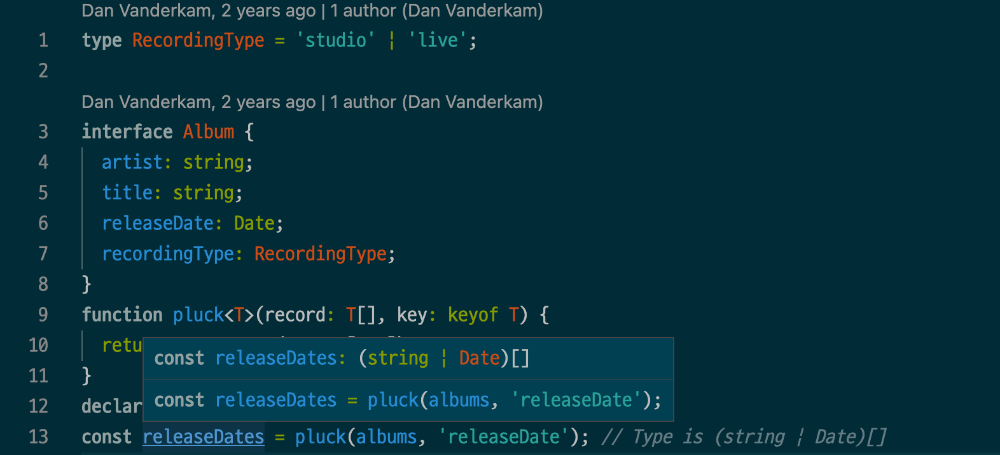
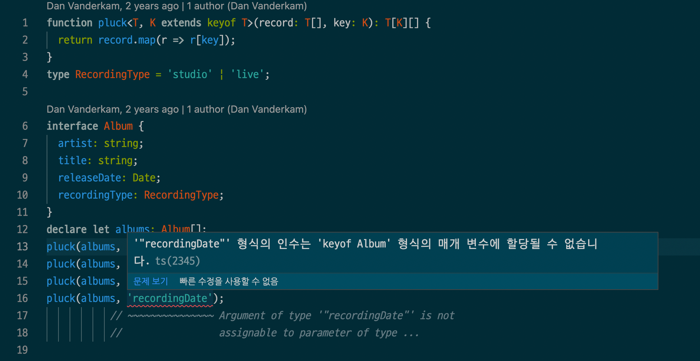
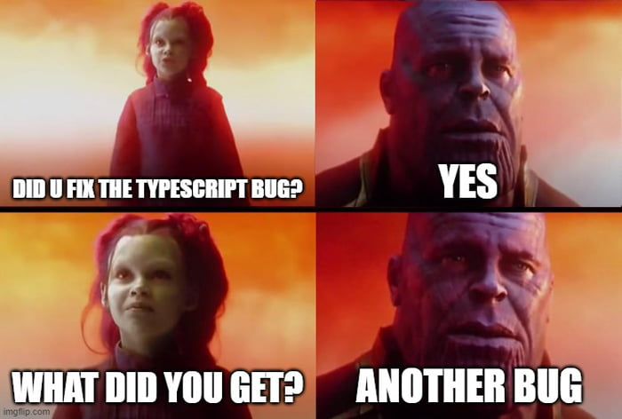
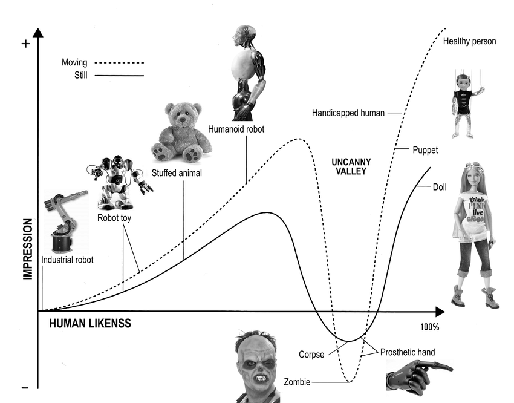

# Item33 ~ Item34

---

4장 타입 설계

[아이템 33: string 타입보다 더 구체적인 타입 사용하기](https://www.notion.so/b148efbbd46f4c4686e253450ee08862)

[아이템 34: 부정확한 타입보다는 미완성 타입을 사용하기](https://www.notion.so/b148efbbd46f4c4686e253450ee08862)

## 아이템 33: string 타입보다 더 구체적인 타입 사용하기

1. ‘문자열을 남발하여 선언된' 코드를 피하기. 모든 문자열을 할당할 수 있는 string 타입보다는 더 구체적인 타입을 사용하는 것이 좋음.
2. 변수의 범위를 보다 정확하게 표현하고 싶다면 string 타입보다는 문자열 리터럴 타입의 유니온을 사용하기. 타입 체크를 더 엄격히 할 수 있으며, 생산성을 향상시킬 수 있음.
3. 객체의 속성 이름을 함수 매개변수로 받을 때는 string보다 keyof T를 사용하는 것이 좋음.

 ⚠️  **문자열을 남발하여 선언된 코드 === “stringly Typed” 피하기**

string 타입의 범위는 매우 넓기 때문에, 문자열로 타입을 선언하기 전에 그보다 더 좁은 타입이 적절하지 않은지 검토해보아야 한다.


**[예시] 음악 컬렉션을 만들기 위해 앨범의 타입을 정의한다고 가정해 보자.**

```jsx
interface Album {
  artist: string;
  title: string;
  releaseDate: string; // YYYY-MM-DD 형식이 와야 함
  recordingType: string; // "live" 또는 "studio"가 와야 함
}
```

🧐  전부 다 문자열이 맞긴 할테지만, 잘못된 점이 있다.

- 어떤 점이 잘못되었을까?
    1. 문자열 타입을 남발함
    2. 주석에 타입 정보를 적은, 잘못된 인터페이스(아이템 30 참고. 주석에 타입 정보를 적게 되면 타입 선언이 중복되거나, 최악의 경우 주석에 써놓은 타입 정보와 실제 타입이 모순되게 된다.)
- 어떤 문제가 발생할 수 있을까?
    1. releaseDate와 recordingType의 형식이 주석에 설명된 것과 다르지만 두 값 모두 문자열이므로 타입 체커를 통과한다!
    
    ```tsx
    const kindOfBlue: Album = {
      artist: "Miles Davis",
      title: "Kind of Blue",
      releaseDate: "1959년도 8월 17일",
      // (1) 의도하지 않은 형식으로 날짜를 선언하더라도 체크하지 못함
      recordingType: "Studio"
      // (2) 의도하지 않은 형식(소문자가 아닌 대문자)으로 녹음 형식을 선언하더라도 체크하지 못함
    
    }
    ```
    
    1. 매개변수 순서가 잘못된 것이 오류로 드러나지도 않는다!
    
    ```tsx
    // 순서 틀렸는데도 잡아내지 못함
    function recordRelease(title: string, date: string) {
      console.log(`앨범 제목: ${title}, 출시일: ${date}`)
    }
    recordRelease(kindOfBlue.releaseDate, kindOfBlue.title)
    ```
    
- **그렇다면, 앞의 앨범 타입을 어떻게 좁혀서 정의할 수 있을까?**

```tsx
type RecordingType = "스튜디오" | "라이브"

interface Album {
  artist: string;
  title: string;
  releaseDate: Date;
  recordingType: RecordingType
}
```

- 위 방식대로 하면 어떻게 오류를 체크할까?
  
    ```tsx
    const kindOfBlue: Album = {
        artist: "Miles Davis",
        title: "Kind Of Blue",
        releaseDate: new Date("1959-08-17"),
        recordingType: "Studio"
        //Type '"studio"' is not assignable to type 'RecordingType'.
    }
    ```
    
- **문자열보다 좁은(구체적인) 타입을 선언하는 방식의 장점 3가지**
1. 타입을 명시적으로 정함으로서 다른 곳으로 값이 전달되어도 타입 정보를 유지

```tsx
function getAlbumsOfType(recordingType: string): Album[] {
  // COMPRESS
  return [];
  // END
}
```

🧐  getAlbumsOfType 함수란 예시로 생각해보자. 

- 만약 타입 선언이 문자열로만 되었다면 어떤 어려움이 있을까?
  
    → getAlbumsOfType 함수를 호출하는 곳에서 recordingType의 값이 string타입이어야 한다는 것 외에는 다른 정보가 없음.
    
    → 함수를 사용하는 사람은 recordingType이 “studio” 혹은 “live”여야 한다는 것을 알 수 없음.
    

1. 타입을 명시적으로 정의하고 해당 타입의 의미를 설명하는 주석을 붙여넣을 수 있음(아이템 48)

```tsx
/** 녹음이 어디에서 이뤄졌는지? */
type RecordingType = "스튜디오" | "라이브"
```

😘  string 대신 RecordingType으로 타입을 바꾸면, 함수를 사용하는 곳에서 RecordingType의 주석(설명)까지 볼 수 있다!

1. keyof 연산자로 더욱 세밀하게 객체의 속성 체크가 가능해짐

어떤 배열에서 한 필드의 값만 추출하는 함수(마치 [Underscore 라이브러리의 pluck](https://underscorejs.org/#pluck) 같은)의 시그니처를 작성한다고 생각해보자.

```tsx
function plunk(records: any[], key: string): any[] {
  return records.map((r) => r[key]);
}
```

- 위 코드는 왜 나쁠까?
    - 타입 체킹을 하긴 하지만, any 타입이 있어서 정교하지 않다
    - 특히, 반환 값으로 any를 사용해서 별로다(item 38 참고)

🧐  위의 코드가 왜 나쁜지 알았다면, 제네릭으로 타입 선언을 구체화해보자.

```tsx
function plunk<T>(records: T[], key: string): any[] {
  return records.map((r) => r[key]);
} 
```

- 그런데 이 코드에도 문제가 있다. 무엇일까?
  
    ```tsx
    function plunk<T>(records: T[], key: string): any[] {
      return records.map((r) => r[key]);
    } 
    
    // 오류 발생~!
    // Element implicitly has an 'any' type because expression of type 'string' can't be used to index type 'unknown'.
    // No index signature with a parameter of type 'string' was found on type 'unknown'.
    ```
    
    key의 타입이 string이기 때무에 범위가 너무 넓다는 오류 발생
    
    🤔 오류에 대해 더 알아보고 싶다면
    
    → [**스택오버플로우 답변**](https://stackoverflow.com/questions/57086672/element-implicitly-has-an-any-type-because-expression-of-type-string-cant-b)
    
    **→ [TypeScript에서 string key로 객체에 접근하기](https://soopdop.github.io/2020/12/01/index-signatures-in-typescript/)**
    

🧐  제네릭만으론 부족하다. keyof를 사용해보자.

```tsx
function plunk<T>(records: T[], key: keyof T) {
  return records.map((r) => r[key]);
}
```

- 여전히 문제가 있다. 뭘까?
  
    T[keyof T]는 T 객체 내의 가능한 모든 값의 타입
    
    그런데 key의 값으로 하나의 문자열을 넣게 되면, 그 범위가 너무 넓어서 적절한 타입이라고 보기 어려움.
    
    
    

**😊  최최최최종 타입 선언**

keyof T는 string에 비하면 훨씬 범위가 좁지만 그래도 여전히 넒다.

따라서 keyofT의 부분집합으로 두 번째 제네릭 매개변수를 도입해보자. (extends는 item14 참고)

```tsx
function plunk<T, K extends keyof T>(records: T[], key: K): T[K][] {
  return records.map((r) => r[key]);
}
```

타입 시그니처가 완벽해졌다! 제대로 반환 타입을 추론하고, 무효한 매개변수를 방지한다.



[🏃🏻‍♂️ **참고 -** ****How to Use the `keyof` Type Operator in TypeScript****](https://blog.devgenius.io/how-to-use-the-keyof-type-operator-in-typescript-6d5e0ea6740f)

## 아이템 34: 부정확한 타입보다는 미완성 타입을 사용하기

1. 타입이 없는 것보다 잘못된 게 더 나쁨.
2. 정확하게 타입을 모델링할 수 없다면, 부정확하게 모델링하지 말아야 함. 또한 any와 unknown을 구별해서 사용해야 함.
3. 타입 정보를 구체적으로 만들수록 오류 메시지와 자동 완성 기능에 주의를 기울여야 함. 정확도뿐만 아니라 개발 경험과도 관련됨.

 ⚠️  **잘못된 타입은 없는 타입만 못하다.**

일반적으로 타입이 구체적일수록 버그를 더 많이 잡고 타입스크립트가 제공하는 도구를 잘 활용할 수 있다. 그러나 타입 정밀도는 주의해서 높여야 한다.



[**예시 1] GeoJson 형식의 타입을 선언한다고 가정해보자. (item 31 참고)**

```tsx
interface Point {
  type: "Point";
  coordinates: number[];
}

interface LineString {
  type: "LineString";
  coordinates: number[][];
}

interface Polygon {
  type: "Polygon";
  coordinates: number[][];
}

type Geometry = Point | LineString | Polygon;
```

🧐  그런데... coordinates에 쓰이는 number[]가 좀 추상적이지 않은가?

→ 코드를 개선해볼까? 좌표에는 경도와 위도만 있을테니, 튜플 타입으로 선언해보자.

```tsx
type GeoPosition = [number, number];

interface Point {
  type: "Point";
  coordinates: GeoPosition;
}
...
```

😊  타입을 구체적으로 선언했으니 사람들이 좋아하겠지!

- 아니다. 싫어한다. 이유가 뭘까?
    - 좌표에는 경도와 위도만 있을 것 같지만, 고도 혹은 다른 정보가 있을 수 있음
    - 현재 타입 선언문을 따르려면 사람들은 타입 단언문을 도입하거나 as any를 추가해 선언해야 함
      
        → 타입 정밀화를 하기 전만 못한 상황이 되었다!
        

**[예시 2]** **[Mapbox 라이브러리](https://docs.mapbox.com/mapbox.js/api/v3.3.1/)의 입력값으로 올 수 있는 범위를 살펴보고, 그 타입을 모델링해보자.**

](assets/item33-Untitled4.png)

 이번에 처음 봤는데 맵박스 gljs 사이트 멋있음...^.^ [https://www.mapbox.com/mapbox-gljs](https://www.mapbox.com/mapbox-gljs)

- 입력값 범위(조건이라고 생각할 수도 있을 듯!)
    1. 모두 허용
    2. 문자열, 숫자, 배열 허용
    3. 문자열, 숫자, 알려진 함수 이름으로 시작하는 배열 허용
    4. 각 함수가 받는 매개변수의 개수가 정확한지 확인
    5. 각 함수가 받는 매개변수의 타입이 정확한지 확인

🧐  입력값 [범위 1](https://www.notion.so/b148efbbd46f4c4686e253450ee08862), [범위 2](https://www.notion.so/b148efbbd46f4c4686e253450ee08862)는 타입 모델링이 어렵지 않다! 테스트 코드와 함께 생각해보자.

```tsx
// 타입 선언
type Expression1 = any;
type Expression2 = string | number | any[];
```

```tsx
// 테스트 코드
const tests: Expression2[] = [
  10,
  "red",
  true,
  ["+", 10, 5],
  ["case", [">", 20, 10], "red", "blue", "green"],
  ["**", 2, 31],
  ["rgb", 255, 128, 64],
  ["rgb", 255, 0, 127, 0],
];
```

- 테스트 코드의 어떤 부분에서 오류가 발생할까?
  
    ```tsx
    const tests: Expression2[] = [
      10,
      "red",
      true, // ~~~ Type 'boolean' is not assignable to type 'Expression2'.
      ["+", 10, 5],
      ["case", [">", 20, 10], "red", "blue", "green"], 
      ["**", 2, 31], 
      ["rgb", 255, 128, 64],
      ["rgb", 255, 0, 127, 0], 
    ];
    ```
    

🧐  입력값 [범위 3](https://www.notion.so/b148efbbd46f4c4686e253450ee08862)도 생각해 모델링해보자! 타입 정밀도를 끌어올려본다!

```tsx
// 타입 선언
type FnName = '+' | '-' | '*' | '/' | '>' | '<' | 'case' | 'rgb';
type CallExpression = [FnName, ...any[]];
type Expression3 = number | string | CallExpression;
```

- 테스트 코드의 어떤 부분에서 오류가 발생할까?
  
    ```tsx
    const tests: Expression3[] = [
      10,
      "red",
      true,
    // ~~~ Type 'true' is not assignable to type 'Expression3'
      ["+", 10, 5],
      ["case", [">", 20, 10], "red", "blue", "green"],
      ["**", 2, 31],
    // ~~~~~~~~~~~ Type '"**"' is not assignable to type 'FnName'
      ["rgb", 255, 128, 64]
    ];
    ```
    

🧐  입력값 [범위 4](https://www.notion.so/b148efbbd46f4c4686e253450ee08862)도 생각해 모델링해보자! 타입 정밀도를 또 한 번 끌어올린다!

→ 그런데... 함수의 매개변수 개수를 알아내기 위해서는 최소한 1개의 인터페이스를 추가해야 한다.

→ 아래처럼 각 인터페이스를 나열해서 호출 표현식을 작성해볼까?

```tsx
type Expression4 = number | string | CallExpression;

type CallExpression = MathCall | CaseCall | RGBCall;

interface MathCall {
  0: '+' | '-' | '/' | '*' | '>' | '<';
  1: Expression4;
  2: Expression4;
  length: 3;
}

interface CaseCall {
  0: 'case';
  1: Expression4;
  2: Expression4;
  3: Expression4;
  length: 4 | 6 | 8 | 10 | 12 | 14 | 16 // etc.
}

interface RGBCall {
  0: 'rgb';
  1: Expression4;
  2: Expression4;
  3: Expression4;
  length: 4;
}
```

😊  코드 정밀도를 계속 올린 결과, 이제 무효한 코드에서 모두 오류가 발생한다!

```tsx
const tests: Expression4[] = [
  10,
  "red",
  true,
// ~~~ Type 'true' is not assignable to type 'Expression4'
  ["+", 10, 5],
  ["case", [">", 20, 10], "red", "blue", "green"],
// ~~~~~~~~~~~~~~~~~~~~~~~~~~~~~~~~~~~~~~~~~~~~~~
//  Type '["case", [">", ...], ...]' is not assignable to type 'string'
  ["**", 2, 31],
// ~~~~~~~~~~~~ Type '["**", number, number]' is not assignable to type 'string
  ["rgb", 255, 128, 64],
  ["rgb", 255, 128, 64, 73]
// ~~~~~~~~~~~~~~~~~~~~~~~~ Type '["rgb", number, number, number, number]'
//                          is not assignable to type 'string'
];
```

→ 그런데 이게 좋은 코드일까?

- 아니다. 나쁘다. 왜 나쁠까?
    - 오류 메시지가 난해해졌다 → 저 메시지를 보고 바로 오류의 원인을 알아낼 수 있을까?
    - 자동 완성을 방해한다 → 타입스크립트 개발 경험을 해치게 되었다!
    
    ⇒ 역효과 발생. 이런 경우에는 차라리 테스트 세트를 추가하여 놓친 부분이 없는지 확인하자!
    

**[결론] 위 예시들에서 살펴보았듯, 코드를 더 정밀하게 만드려는 시도는 오히려 역효과를 불러올 수 있다.** 

일반적으로 any 같은 추상적 타입은 정제하는 것이 좋다. 그렇지만 타입을 정제한다고 무조건 정확도가 올라가고 좋은 코드를 작성하게 되는 것은 아니다.

타입을 정제할 때는 `불쾌한 골짜기` 은유를 생각해 보자. 어설프게 인간을 닮으려고 하다가 괜히 불쾌해지는 로봇처럼.. 어설프게 완벽한 타입을 추구하다가 불쾌한 타입 모델링을 하게 될 수 있다!

