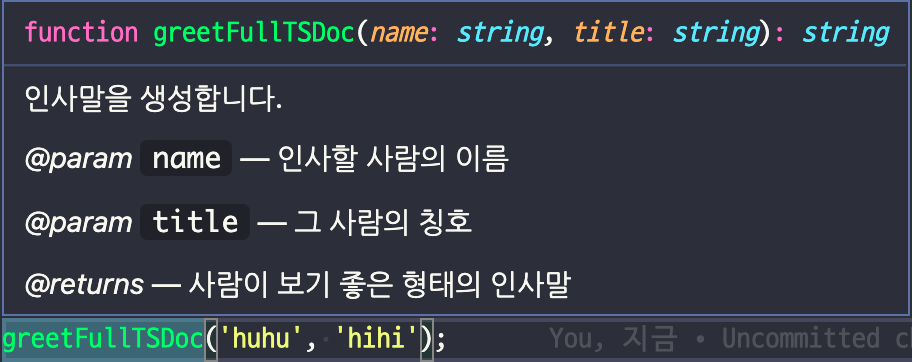

# Item 47 ~ Item 50

## Item 47 공개 API에 등장하는 모든 타입을 익스포트하기 (****Export All Types That Appear in Public APIs)****

```tsx
interface SecretName {
  first: string
  last: string
}

interface SecretSanta {
  name: SecretName
  gift: string
}

export function getGift(name: SecretName, gift: string): SecretSanta {
  // ...
}
```

서드파티 모듈에서 어떤 타입을 익스포트하지 않았다고 가정해봅니다.

`SecretName` 과 `SecretSanta` 를 직접 임포트할 수 없고 `getGift` 만 임포트가 가능합니다. 

`SecretName` 과 `SecretSanta` 는 함수 시그니처에 등장하기 때문에 추출해 낼 수 있습니다. 

```tsx
// Parameters와 ReturnType을 사용하기
type MyName = Parameters<typeof getGift>[0] // SecretName
type MySanta = ReturnType<typeof getGift> // SecretSanta
```

공개 메서드에 등장한 어떤 형태의 타입이든 익스포트하는 것을 권고합니다. 공개 API 매개변수에 놓이는 순간 타입은 노출되기 때문입니다.. 

(질문, 의견)

## Item 48 API 주석에 TSDoc 사용하기 (****Use TSDoc for API Comments)****

```tsx
// 인사말을 생성합니다. 결과는 보기 좋게 꾸며집니다. 인라인 스타일 🙅‍♀️ <- 툴팁에 표시되지 않음
/** 인사말을 생성합니다. 결과는 보기 좋게 꾸며집니다. 🙆‍♀️ */
function greet(name: string, title: string) {
  return `Hello ${title} ${name}`
}
```

JSDoc스타일의 주석을 달면 툴팁으로 표시해 줍니다.


공개 API에 주석을 붙인다면 @param과 @returns 같은 일반 규칙을 사용할 수 있는 JSDoc형태(TSDoc)로 작성해야합니다. 

```tsx
/**
 * 인사말을 생성합니다.
 * @param name 인사할 사람의 이름
 * @param title 그 사람의 칭호
 * @returns 사람이 보기 좋은 형태의 인사말
 */
function greetFullTSDoc(name: string, title: string) {
  return `Hello ${title} ${name}`
}
```



```tsx
// MUI 예시

/**
 * Gets the mode of a cell.
 * @param {GridRowId} id The id of the row.
 * @param {string} field The field to get the mode.
 * @returns {GridCellMode} Returns `"edit"` or `"view"`.
 */
getCellMode: (id: GridRowId, field: string) => GridCellMode;
```

JSDoc에는 **@param `{string}` name**      

타입 정보를 명시하는 규칙이 있지만 TSDoc는 타입 정보를 명시하지 않습니다.

타입정의에도 사용하기

```tsx
interface Vector3D {
  /** x 여기 */
  x: number;
  y: number;
  z: number;
}

interface Measurement {
  /** 어디에서 측정되었나? */
  position: Vector3D;
  /** 언제 측정되었나? epoch에서부터 초 단위로 */
  time: number;
  /** 측정된 탄력 */
  momentum: Vector3D;
}

const m: Measurement = {
  time: new Date().getTime() / 1000,
  position: {
    x: 0,
    y: 0,
    z: 0,
  },
  momentum: {
    x: 0,
    y: 0,
    z: 0,
  },
};
```


```tsx
// MUI 예시

/**
 * Object passed as parameter in the onRowsScrollEnd callback.
 */
interface GridRowScrollEndParams {
    /**
     * The number of rows that fit in the viewport.
     */
    viewportPageSize: number;
    /**
     * The number of rows allocated for the rendered zone.
     */
    virtualRowsCount: number;
    /**
     * The grid visible columns.
     */
    visibleColumns: GridColumns;
}
```

```tsx
/**
 * 이 _interface_ 는 **세 가지** 속성을 가집니다.
 * 1. x
 * 2. y
 * 3. z
 */
interface Vector3D {
  x: number;
  y: number;
  z: number;
}
```

TSDoc 주석은 마크다운 형식으로 꾸며지므로 굵은 글씨, 기울임 글씨, 글머리기호 목록을 사용할 수 있습니다.


(질문, 의견)

## Item 49 콜백에서 this에 대한 타입 제공하기 (****Provide a Type for this in Callbacks)****

this는 dynamic scope이기 때문에 호출된 방식에 따라 달라집니다. this의 사용법을 반드시 기억해야 합니다. 

**콜백 함수에서 this 값을 사용한다면** 

- this는 API 일부가 되는 것이기 때문에 반드시 타입 선언에 포함해야 합니다.
- this 바인딩이 동작하는 원리를 이해하고 this 바인딩 문제를 고려해야 합니다.
- 콜백함수의 매개변수에 this를 추가하면 **this 바인딩이 체크되기 때문에** 실수를 방지할 수 있습니다.

```tsx
function addKeyListener(el: HTMLElement, fn: (this: HTMLElement, e: KeyboardEvent) => void) {
  el.addEventListener('keydown', e => {
    fn.call(el, e) // call을 사용하여 this를 바인딩 했기 때문에 fn의 this는 이제 HTMLElement이 됩니다.
  })
}
```

매개변수에 this를 추가하고, 콜백 함수를 call를 호출하였습니다.
this 바인딩은 자바스크립트의 동작이기 때문에, 타입스크립트 역시 this 바인딩을 그대로 모델링하게 됩니다. 

```tsx
function addKeyListener(el: HTMLElement, fn: (this: HTMLElement, e: KeyboardEvent) => void) {
  el.addEventListener('keydown', e => {
	  // fn.call(el, e)  
		fn(el, e)
    // ~ 1개의 인수가 필요한데 2개를 가져왔습니다.
  })
}
```

call을 제거하고 fn을 두 개의 매개변수로 호출 했을 시, **this는 특별하게 처리되는 것을 확인하실 수 있습니다.** 

```tsx
function addKeyListener(el: HTMLElement, fn: (this: HTMLElement, e: KeyboardEvent) => void) {
  el.addEventListener('keydown', e => {
    fn(el)
    // ~ 'void' 형식의 'this' 컨텍스트를 메서드의 'HTMLElement' 형식 'this'에 할당할 수 없습니다.
  })
}
```

1개를 적었을 경우, 에러가 발생합니다.

```tsx
function addKeyListener(el: HTMLElement, fn: (this: HTMLElement, e: KeyboardEvent) => void) {
  el.addEventListener('keydown', e => {
    fn.call(el, e)
  })
}

declare let el: HTMLElement
addKeyListener(el, function (e) {
  this.innerHTML // 정상 this는 HTMLElement 타입
})
```

this를 정의하면 라이브러리 사용자의 콜백 함수에는 this를 참조할 수 있고 안정성도 얻을 수 있습니다.

```tsx
function addKeyListener(el: HTMLElement, fn: (this: HTMLElement, e: KeyboardEvent) => void) {
  el.addEventListener('keydown', e => {
    fn.call(el, e)
  })
}
class Foo {
  registerHandler(el: HTMLElement) {
    addKeyListener(el, e => {
      this.innerHTML
      // ~~~~~~~~~ 'Foo' 유형에 'innerHTML' 속성이 없습니다.
    })
  }
}
```

콜백함수의 매개변수에 this를 추가하면 **this 바인딩이 체크되기 때문에** 실수를 방지할 수 있습니다.

만약에 사용자가 콜백을 화살표 함수로 작성하고 this를 참조하려고 하면 타입스크립트가 문제를 잡아냅니다.

화살표 함수는 함수를 선언할 때 this에 바인딩할 객체가 정적으로 결정됩니다. 

동적으로 결정되는 일반 함수와는 달리 **화살표 함수의 this 언제나 상위 스코프의 this를 가리킵니다.** (Lexical this)

(질문, 의견)

## Item50 오버로딩 타입보다는 조건부 타입을 사용하기

```tsx
function double(x) {
  return x + x; 
}
```

```tsx
function double(x: number | string): number | string
function double(x: any) {
  return x + x
}
const num = double(12) // string | number
const str = double('x') // string | number
```

오버로딩: 선언체는 여러개, 구현체는 하나
double 함수에는 string 또는 number 타입의 매개변수가 들어올 수 있습니다. 그러므로 유니온 타입을 추가했습니다. 선언이 틀린것이 아니지만, 모호한 부분이 있습니다.

```tsx
function double<T extends number | string>(x: T): T
function double(x: any) {
  return x + x
}

const num = double(12) // Type is 12
const str = double('x') // Type is "x"
```

제네릭을 사용해 타입을 구체적으로 만들어 보려는 시도는 좋았지만 너무 과했습니다. 이제 타입은 너무 과하게 구체적입니다. 리터럴 문자열 ‘x’를 매개변수로 넘겨 동일한 리터럴 문자열 ‘x’가 반환되는 것으로 되었습니다.

```tsx
function double(x: number): number
function double(x: string): string
function double(x: any) {
  return x + x
}

const num = double(12) // Type is number
const str = double('x') // Type is string
```

타입 선언을 분리합니다. 타입스크립트에서 함수의 구현체는 하나지만, 타입 선언은 몇 개든지 만들 수 있습니다. 

```tsx
function f(x: number | string) {
  return double(x)
  // ~ Argument of type 'string | number' is not assignable
  //   to parameter of type 'string'
}
```

유니온타입 관련해서 문제가 발생합니다. 타입스크립트는 오버로딩 타입 중에서 일치하는 타입을 찾을 때까지 순차적으로 검색합니다. string|number 타입은 string에 할당할 수 없기 때문에 오류가 발생합니다. 

`function double(x: string|number): string|number` 로 해서 세번째 오버로딩을 추가하여 해결할 수 있지만 가장 좋은 해결책은 조건부 타입을 사용하는 것 입니다. 

```tsx
function double<T extends number | string>(x: T): T extends string ? string : number
function double(x: any) {
  return x + x
}
```

조건부 타입은 타입 공간의 if구문과 같습니다. 자바스크립트의 삼항 연산자(?:) 처럼 사용하면 됩니다. 

- T가 string의 부분집합이면(string, 또는 문자열 리터럴, 또는 문자열 리터럴의 유니온), 반환 타입은 string입니다.
- 그 외의 경우는 반환 타입이 number 입니다.

조건부 타입이라면 앞선 예제가 모두 동작합니다.

오버로딩 타입을 작성중이라면 조건부 타입을 사용해서 개선할 수 있을지 검토해 보는 것이 좋습니다. 

조건부 타입은 추가적인 오버로딩 없이 유니온 타입을 지원할 수 있습니다.