# Item 58 ~ 62

# 8장. 타입스크립트로 마이그레이션하기

---

```markdown
8장에서는 **크고,** **오래된 자바스크립트 프로젝트를 꾸준하게 타입스크립트로 마이그레이션하는
몇 가지 방법을 소개하는 장**입니다.

아이템 58 에서는 모던 자바스크립트으로 마이그레이션 시작하는 방법을,
아이템 59 에서는 타입스크립트로 간단하게 테스트하는 방법을,
아이템 60 에서는 점진적 타입스크립트 마이그레이션을,
아이템 61 에서는 의존성 관게도를 시각화하여 진행하는 방법을.
아이템 62 에서는 마이그레이션 마지막 단계를 진행하는 방법을 다룹니다.
```

## Item 58. 모던 자바스크립트로 작성하기

- 타입스크립트는 타입 체크 기능 외에, 타입스크립트 코드를 특정 버전의 자바스크립트로
컴파일하는 기능을 가지고 있습니다.
- 즉, 타입스크립트 컴파일러를 자바스크립트 트랜스파일러로 사용할 수 있다는 뜻으로 해석할 수 있습니다.
- 이를 통해 옛날 버전의 자바스크립트 코드를 최신 버전의 자바스크립트로 변경하는 작업은
타입스크립트로 전환하는 작업의 일부로 볼 수 있습니다.

### 1. **ECMAScript 모듈 사용하기**

- ES2015 부터는 import, export 를 사용하는 ECMAScript 모듈이 표준이 되었습니다.
- 이를 사용할 경우 모듈 단위로 전환할 수 있기 때문에 점진적 마이그레이션이 가능하다는 이점이 있습니다.

> commonJS 모듈 시스템
> 

> ECMAScript 모듈 시스템
> 

```jsx
// a.js
const b = require('/b');
console.log(b.name);

// b.js
const name = 'Module B';
module.exports = { name };
```

```jsx
// a.ts
import * as b from './b';
console.log(b.name);

// b.ts
export const name = 'Module B';

```

### 2. 프로토타입 대신 클래스 사용하기

- 마이그레이션 대상 코드에서 단순한 객체를 다룰 때 프로토타입을 사용하고 있었다면
클래스 타입으로 바꾸는 것이 좋습니다. 다음은 단순 객체를 프로토타입으로 구현한 예제입니다.

> Prototype 예제
> 

```tsx
function Person(first, last) {
  this.first = first;
  this.last = last;
}

Person.prototype.getName = function() {
  return this.first + ' ' + this.last;
}

const marie = new Person('Marie', 'Curie');
const personName = marie.getName(); // Marie Curie
```

> Class 예제
> 

```tsx
class Person {
  first: string;
  last: string;

  constructor(first: string, last: string) {
     this.first = first;
     this.last = last;
  }

  getName() {
    return this.first + ' ' + this.last;
  }
}

const marie = new Person('Marie', 'Curie');
const personName = marie.getName(); // Marie Curie
```

Class 문법을 통해 얻은 장점은 무엇이 있을까요?

- 클래스로 구현한 Person 객체가 문법이 간결하고 직관적이다.

### 3. var 대신 let / const 사용하기

- var 에서 let 혹은 const 로 변경하면 일부 코드에서 타입스크립트가 오류를 표시할 수 있습니다.
- 이러한 오류가 발생한 부분은 오류 그대로 문제가 있다는 부분이므로 수정이 필요합니다.
- 대표적으로는 호이스팅 문제를 빠르게 잡아줍니다. (좌측은 var 적용 시,  우측은 const 적용 시 코드)

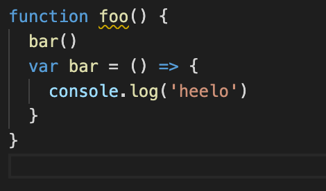

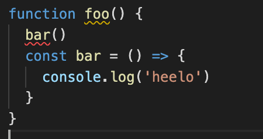

### 4. for 대신 for of 또는 배열 메서드 사용하기

- for 문 대신 for of 를 사용할 경우 인덱스 변수를 사용하지 않아 코드가 간결합니다.
(인덱스 변수가 필요한 경우, forEach 를 사용합시다.)

```tsx
for (let i = 0; i < array.length; i++) {
  const el = array[i];
  // ...
}
```

```tsx
for (const el of array) {
  // ...
}

```

### 5. 함수 표현식보다 화살표 함수 사용하기

- 인라인 혹은 콜백에선 일반 함수보다 화살표 함수가 더 직관적이며 코드도 간결합니다.
- 그 밖에 타입스크립트 컴파일러 옵션에 `noImplicitiThis` 혹은 `strict` 설정 시,
  타입스크립트가 this 바인딩에 대한 오류를 표시합니다.
  
    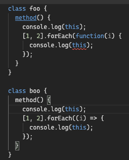
  
    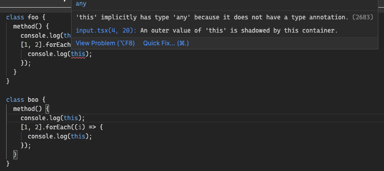
  

### 6. 단축 객체 표현과 구조 분해 할당 사용하기

- 변수와 객체 속성명이 같은 경우, 간단하게 아래와 같이 작성할 수 있습니다.

```tsx
// 단축 객체 표현을 사용하지 않은 경우
const x = 1, y = 2, z = 3;
const pt = {
  x: x,
  y: y,
  z: z,
};
```

```tsx
// 사용한 경우
const x = 1, y = 2, z = 3;
const pt = { x, y, z };

```

- 다음은 객체 구조 분해를 살펴보겠습니다.

```tsx
// 객체 구조 분해를 사용하지 않은 경우
const props = obj.props;
const a = props.a;
const b = props.b;

```

```tsx
// 사용한 경우
const { props } = obj;
const { a, b } = props;

// 혹은
const { props: { a, b } } = obj;
```

- 다음은 구조분해 할당을 살펴보겠습니다.

```tsx
const points = [1, 2, 3];
const [x, y, z] = points;
```

### 7. 함수 매개변수 기본값 사용하기 (Default parameter)

- 매개변수에 기본값을 지정하면 코드가 간결해질 뿐만 아니라 base 가 선택적 매개변수라는 것을
명확히 나타내는 효과도 줄 수 있습니다. 그리고 기본값 기반으로 타입 추론이 가능하기에
타입스크립트로 마이그레이션 시 매개변수에 타입 구문을 쓰지 않아도 괜찮습니다.

### 8. 저수준 프로미스나 콜백 대신 async / await 사용하기

- async 와 await 를 사용하면 코드가 간결해지며 버그나 실수를 방지할 수 있습니다.
- 비동기 코드에 타입 정보가 전달되어 타입 추론이 가능하다. (item 25 참고)

### 9. 연관 배열에 객체 대신 Map 과 Set 사용하기

- 아래 문자열 내의 단어 개수를 세는 함수가 있습니다.
이는 인덱스 시그니처를 사용하여 타입을 지정했지만 문제점이 있습니다.

```tsx
function countWords(text: string) {
  const counts: { [word: string]: number } = {};
  for (const word of text.split(/[\s,.]+/)) {
    counts[word] = 1 + (counts[word] || 0);
  }

  return counts;
}

console.log(countWords('Object have a constructor'));
/**
아래는 결과값입니다. 
	{
	  a: 1,
	  constructor: "1function Object() { [native code] }",
	  have: 1,
	  Object: 1
	}
*/
```

- 음.. 의도와 달리 constructor 값이 뭔가 이상합니다. constructor 는 1개 밖에 없으므로,
다른 값과 마찬가지로 1 (type number) 를 표기할 것으로 예상했지만 문자열 타입입니다.
뒤에 예상치 못한 값도 붙어있습니다.
- 이 코드는 아래와 같은 문제가 있는 것입니다.
    1. 원치 않는 값이 기입되었습니다.
    2. 해당 값의 타입도 인덱스 시그너처의 value type 인 number 가 아닌 string 입니다.
- 문제를 유발하는 코드는 `counts[word] = 1 + (counts[word] || 0);` 입니다.
- counts[word] 로 접근하게 되는데, constructor 문자열이 객체에 접근할 경우, 
undefined 가 아닌 Object.prototype 에 있는 생성자 함수임을 알 수 있습니다.

해당 값의 출력값은 `function Object() { [native code] }` 이 되므로
1 + function Object() { [native code] } 즉 "1function Object() { [native code] }" 이 됩니다.
- 이를 해결하기 위해서 Map 을 활용해보겠습니다.
Map 을 통해 기존 생성자 함수로 접근하는 방식이 아닌 get, set 을 통한 접근으로
문제를 해결할 수 있습니다.

```tsx
function countWords(text: string) {
  const counts: new Map<string, number>();
  for (const word of text.split(/[\s,.]+/)) {
    counts.set(word, 1 + (counts.get(word) || 0));
  }

  return counts;
}
```

### 10. 타입스크립트에 use strict 넣지 않기

- 타입스크립트에서 수행하는 안전성 검사가 strict mode 보다 훨씬 더 엄격한 체크를 하기 때문에,
타입스크립트 코드에서 use strict 는 무의미합니다.
- 실제로는 타입스크립트 컴파일러가 생성하는 자바스크립트 코드에서 use strict 를 추가합니다.
  (alwaysStrict mode 활성화!)
  
    
  

```markdown
### 58장 요약하기

1. 자바스크립트 최신 기능들을 적극적으로 사용하자. 코드 품질 up, 타입 추론도 더 좋아진다.

2. 타입스크립트 컴파일러와 언어 서비스를 통한 클래스, 구조 분해, async await 같은 
   기능을 쉽게 배울 수 있다.

3. use strict 는 타입스크립트 컴파일러 레벨에서 사용되므로 코드에서 제거하자.

4. TC39 의 깃헙 저장소와 타입스크립트 릴리스 노트를 통해 최신 기능을 확인 가능
   (표준화 3단계 이상 기능들은 타입스크립트 내에서 사용가능하므로)
```

## Item 59. 타입스크립트 도입 전에 @ts-check 와 JsDoc 으로 시험하기

---

### 1. @ts-check 는 어떤 일을 해주는 것일까요?

1. 타입 체커가 파일을 분석하게 해줍니다.
2. 발견된 오류를 보고하도록 지시합니다.

### 2. @ts-check 특징?

- 매우 느슨한 수준으로 타입 체크를 합니다. 그 수준은 noImplicitAny 설정을 해제한 것보다 느슨합니다.

### 3. @ts-check 사용법?

- 아래 js 파일로 person 선언 후 문자열을 곱하는 방식입니다.
흠 일단 일반적인 상황은 아닌 것 같습니다. 저게 의도인지도 의문이 듭니다. (number * string??? 🤔)

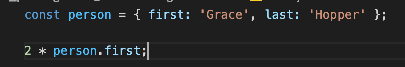

- 그럼 위에서 이야기 해주는 @ts-check 를 추가해보겠습니다.

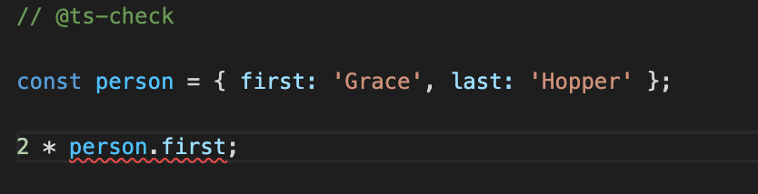

- 여전히 js 파일임에도 불구하고 타입 체크가 동작해서 오류가 발생한 것을 확인할 수 있습니다.
- js 파일에 간단하게 @ts-check 를 추가해서 정말 느슨한 수준의 타입 체크를 먼저 진행할 수 있습니다.

### 4. 선언되지 않은 전역 변수

- 아래 이미지와 같이 자바스크립트에서는 선언하지 않는 값을 에러 없이 사용할 수 있습니다.
  만약 정말 큰 규모의 코드라면 분명 js 환경에선 놓칠 수 있을 것 같습니다.
  
    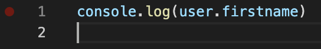
  
- @ts-check 를 적용하겠습니다.
  다행히(?) 오류가 발생한 것을 확인하실 수 있습니다.
  
    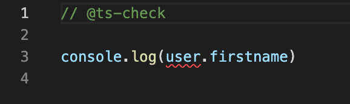
  
- 그 밖에 어딘가에 ‘숨어 있는’ 변수라고 가정해보고 변수를 제대로 인식할 수 있게 별도로
타입 선언 파일을 만들어야 합니다.

```tsx
interface UserData {
  firstName: string;
  lastName: string;
}

declare let user: UserData;
```

```tsx
// @ts-check
/// <reference path="./types.d.ts" />
console.log(user.firstName); // 정상

```

- 타입 선언 파일을 만든 후 선언 파일을 찾지 못하는 경우 ‘트리플 슬래시’ 참조를 사용하여 명시적으로
import 할 수 있습니다.

### 5. 알 수 없는 라이브러리

- 서드파티 라이브러리를 사용하는 경우, 해당 라이브러리의 타입 정보가 필요합니다.
- 보통 이러한 서드파티 라이브러리의 경우, @types/{라이브러리명} 을 install 하면
해당 라이브러리의 타입 정보를 확인하고, 관련된 에러 메시지로 확인이 가능합니다
- 이 역시도 @ts-check 을 사용하여 타입스크립트로 마이그레이션 하기 전
서드파티 라이브러리들의 타입 선언을 활용하여 타입 체크를 시험해 볼 수 있습니다.

### 6. DOM 문제

- 웹 브라우저에서 동작하는 코드라면 타입스크립트는 DOM 엘리먼트 관련 부분에 
많은 오류를 표시하게 됩니다.

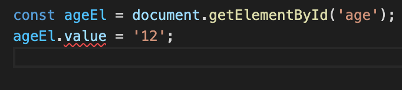

- HTMLInputElement 타입에는 value 속성이 있지만 현재 getElementById 를 통해 조회한
DOM Element 의 경우 HTMLElement 타입을 반환하기에 이러한 에러가 발생합니다. (item 55 참고)
- 이 코드를 작성한 저희는 해당 age 라는 id 값은 Input 엘리먼트라는 것을 `확신` 할 수 있습니다.
- 여기서 그럼 타입 단언문 쓰면 되는 것 아닌가? 싶을 수도 있지만 저희는 지금
.js 파일에서 @ts-check 을 통해 1차적인 타입 체크를 진행하고 있다는 점을 잊으시면 안됩니다.
- 타입 단언문은 javascript 파일에서는 사용할 수 없습니다 ㅠㅠ..
  
    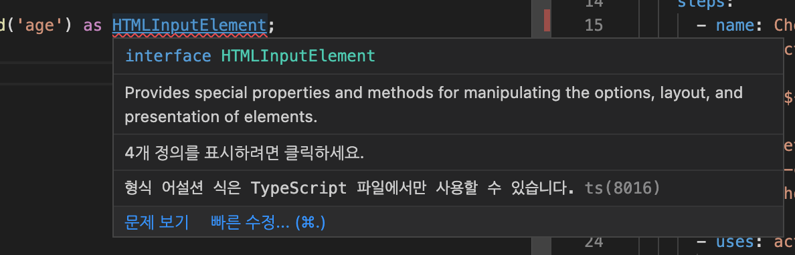
    
- 이 때 JSDoc 을 통해 타입 단언을 대체할 수 있습니다.
  
    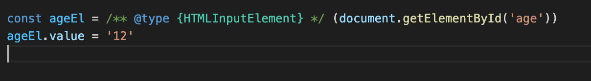
    
- JSDoc 을 통해 type 에 대한 명시를 해줌으로서 발생한 오류를 잡을 수 있습니다.

### 7. 부정확한 JSDoc

- 프로젝트에 이미 JSDoc 을 사용하고 있다면 @ts-check 을 설정하는 순간부터 기존 주석에
타입 체크가 동작하고 많은 오류가 발생하게 될 것입니다.

```tsx
/**
 * @param {Node} el
 * @returns {{ w: number, h: number }}
 */
function getSize(el) {
  const bounds = el.getBoundingClientRect();

  return { width: bounds.width, height: bounds.height };
}
```

- 위와 같이 작성한 js 코드에 @ts-check 를 추가한다면?
  
    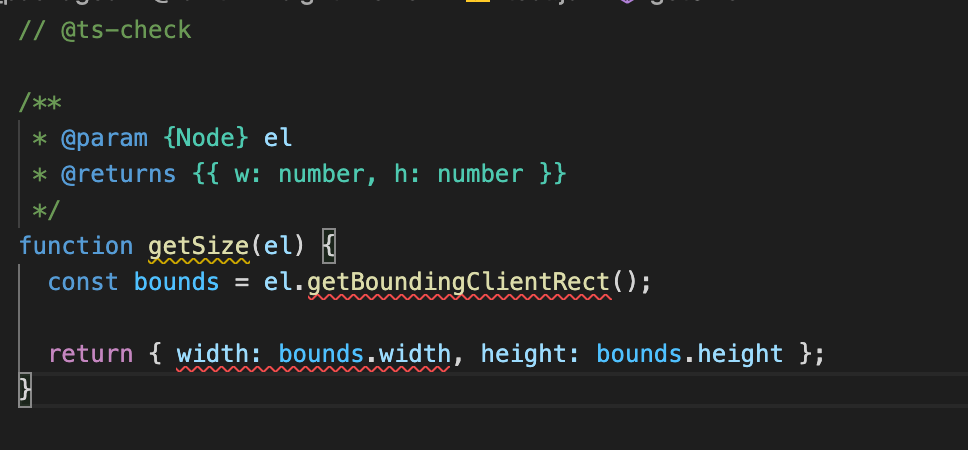
    
- 에러가 발생하는 것을 보실 수 있습니다. 해당 오류 대상에 hover 해서 내용을 보면
  아래와 같은 에러 내용을 볼 수 있습니다. 해당 내용을 보고 천천히 변경하시면 됩니다.
  
    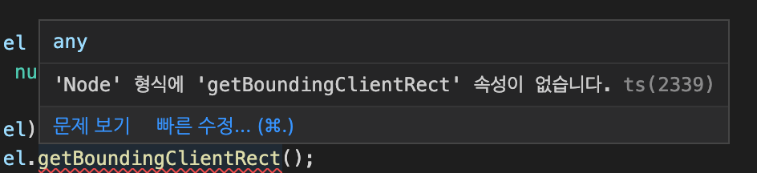
  
    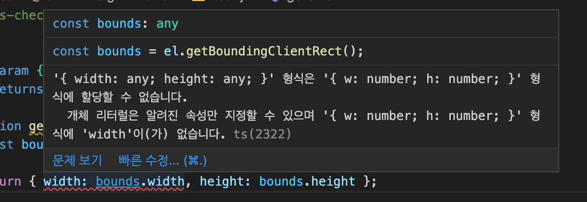
  
- getBoundingClientRect() 는 Node 가 아닌 Element 에 정의되어 있으므로 변경이 필요합니다.
- return type 에 width 와 height 가 아닌 w, h 로 정의했기에 에러가 발생했습니다.
일반적으로 width, height 라고 하므로 return type JSDoc 을 변경하는 것이 더 좋은 방식으로 보입니다.

```markdown
### 59장 요약

1. 파일 상단에 // @ts-check 를 추가하면 자바스크립트에서도 타입 체크를 수행할 수 있다.

2. 전역 선언과 서드파티 라이브러리의 타입 선언을 추가하는 방법을 익혀보자.

3. JSDoc 주석을 잘 활용하면 JS 상태에서도 타입 단언과 타입 추론이 가능합니다.

4. JSDoc 주석은 중간 단계이기 때문에 너무 공들일 필요는 없습니다.
   최종 목표는 js 파일이 아닌 ts 파일이라는 점 명심합시다. 
```

## Item 60. allowJS 로 타입스크립트와 자바스크립트 같이 사용하기

---

- 소규모 프로젝트는 한꺼번에 타입스크립트로 전환할 수 있습니다. 그러나 대규모 프로젝트는
한꺼번에 작업하는 것이 불가능하므로 점진적으로 전환할 수 있어야 합니다.
- 이를 위해 마이그레이션 기간 중에 자바스크립트와 타입스크립트가 동시 동작이 가능해야 합니다.
- 위 동시 동작은 allowJs 컴파일러 옵션이 해답이 됩니다.
역할은 타입스크립트 파일과 자바스크립트 파일을 서로 import 할 수 있도록 해줍니다.
- 유닛 테스트 도구에서도 동일한 역할을 하는 옵션이 존재합니다.
jest 에서는 ts-jest 사용 후 jest.config.js 에 전달할 타입스크립트 소스를 지정합니다.

```tsx
module.exports = {
  transform: {
		'^.+\\.tsx?$': 'ts-test',
  },
};
```

- 만약 프레임워크 없이 빌드 체인을 직접 구성했다면 복잡한 작업이 필요할 것 입니다.
- 책에서는 이에 대한 방책으로 outDir 옵션을 추천합니다.
outDir 옵션을 통해 타입스크립트가 outDir 에 지정된 디렉토리에 
소스 디렉터리와 비슷한 구조로 자바스크립트 코드를 생성하게 되고, 
outDir 로 지정된 디렉토리 대상으로 기존 빌드 체인을 실행하면 됩니다.
- 타입스크립트로 마이그레이션 하는 동시에 빌드, 테스트가 동작하게 하는 것이 힘들지만,
제대로 된 마이그레이션을 시작하기 위해서는 반드시 필요합니다.

```markdown
### 60장 요약

1. 점진적 마이그레이션을 위해 자바스크립트와 타입스크립트를 동시에 사용할 수 있게
   allowJs 컴파일러 옵션을 사용합시다

2. 대규모 마이그레이션 작업을 시작하기 전, 테스트와 빌드 체인에 타입스크립트를 사용해야합니다.
```

## Item 61. 의존성 관계에 따라 모듈 단위로 전환하기

---

### 1. 모듈 단위로 마이그레이션 하는 법

- 점진적 마이그레이션은 모듈 단위로 각개격파하는 것이 이상적입니다.
- 이 때 한 모듈을 골라서 타입 정보를 추가하면, 
해당 모듈이 의존하는 모듈에서 비롯되는 타입 오류가 발생하게 됩니다.
- 의존성과 관련된 오류 없이 작업하려면? 다른 모듈에 의존하지 않는 최하단 모듈부터
작업을 시작해서 의존성의 최상단에 있는 모듈을 마지막으로 완성해야 합니다.

```markdown
1. 서드파티 라이브러리는 해당 모듈(프로젝트 내 나의 모듈)에 의존하지 않기 때문에
   서드파티 라이브러리 타입 정보를 가장 먼저 해결
   이는 해당 라이브러리의 @types 모듈을 설치하면 됩니다.

2. 외부 API 를 호출하는 경우도 있는데, 두 번째 대상은 이 외부 API 의 타입 정보를 추가하는 것입니다.
```

- 이러한 모듈 단위 격파를 위해선 의존성 관계를 시각화 해보면 많은 도움이 됩니다.
  책에서 추천해주는 것은 madge 라는 도구를 사용해보는 것입니다.
  이를 통해 모듈 간 의존성을 시각화한 관계도를 얻을 수 있습니다.
  
    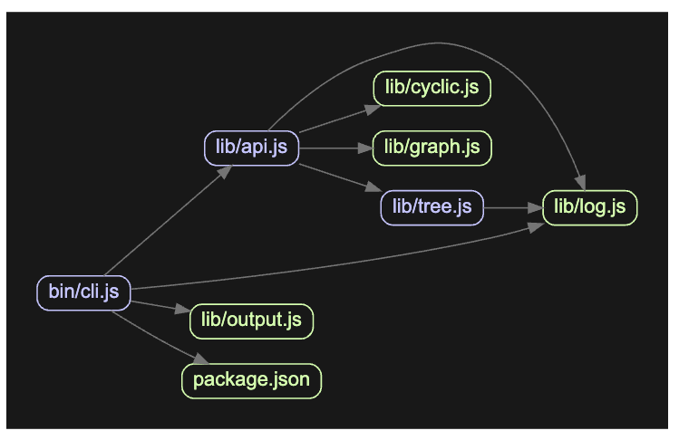
  
- 더불어 마이그레이션 할 때는 타입 정보만 추가하고, 리팩토링을 해서는 안됩니다.
오래된 프로젝트일수록 개선이 필요한 부분을 자주 마주치겠지만,
당장의 목표는 코드 개선이 아닌 타입스크립트로 전환하는 것임을 명심해야 합니다.
- 개선할 내용이 있다면 따로 정리 후 리팩토링 시간을 별도로 가져가는 것을 추천합니다.

### 2. 선언되지 않은 클래스 멤버

- 자바스크립트는 클래스 멤버 변수를 선언할 필요가 없지만, 타입스크립트는 명시적 선언이 필요합니다.
- 이를 수행하지 않을 경우 참조하는 속성마다 오류가 발생합니다.
- .ts 로 변경 후 에러 위치에 hover 하여 Quick fix 기능으로 빠르고 간단하게 해결이 가능합니다.
- 이 과정에서 any 로 추론되는 경우엔 직접 수정하면 됩니다.

### 3. 타입이 바뀌는 값

- 다음 코드는 자바스크립트일 때는 문제가 없지만, 타입스크립트가 되는 순간 오류가 발생합니다.

```tsx
const state = {};
state.name = 'New York';
state.capital = 'Albany';
```

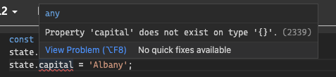

- 한꺼번에 선언할 경우 해결할 수 있지만, 그렇지 않을 경우 타입 단언문을 통해 해결이 가능합니다.

```tsx
interface State {
  name: string;
  capital: string;
}

const state = {} as State;
state.name = 'New York';
state.capital = 'Albany';
```

- 당장은 마이그레이션이 중요하기 때문에 타입 단언문을 사용한 것이며, 마이그레이션이 완료된 후에는
타입 단언문을 없애는 방향으로 변경해야합니다.

- 이제 마지막 단계로, 테스트 코드를 타입스크립트로 전환하면 됩니다.
로직 코드가 테스트 코드에 의존하지 않기 때문에 테스트 코드는 항상 의존성 관계도의 최상단에 위치,
마이그레이션의 마지막 단계가 되는 것이 당연합니다.
- 이는 타입스크립트로 전환하는 과정에서 테스트 코드는 수정하지 않고, 계속 기존과 같이
테스트를 수행할 수 있다는 뜻인데 이건 엄청난 이점입니다.

```markdown
### 61장 요약

- 마이그레이션 첫 단계는 서드파티 모듈 & 외부 API 호출에 대한 @types 를 추가하는 것

- 의존성 관계도의 아래에서 위로 올라가며 마이그레이션하면 됩니다.
  첫 번째 모듈은 보통 유틸리티 모듈이며, 이 때 의존성 관계도를 시각화하여 진행하는 것이 좋습니다.

- 이상한 설계를 발견하더라도 리팩토링은 금물! 나중의 리팩토링을 위해 목록을 만듭시다.

- 타입스크립트로 전환하며 발견하는 일반적인 오류들을 놓치지 말고, 필요에 따라 JSDoc 주석을 잘 활용 
```

## Item 62. 마이그레이션의 완성을 위해 noImpicitAny 설정하기

---

- 프로젝트 전체를 .ts 파일로 전환했다면 매우 큰 진척을 이뤄낸 것입니다. 🎉
- 이제 마지막 단계인 noImpicitAny 를 설정하는 것입니다.
- any 로 처리된 것들을 모두 정확한 의도에 맞는 타입으로 지정하여 해결하는 것입니다.
- 아래와 같이 Chart class 내 indices 가 any 타입으로 추론된 것을 볼 수 있습니다.
(noImpicitAny 값이 false 라고 가정한 상태입니다.)

```tsx
class Chart {
  indices: any;

  // ...
}
```

- indices 는 숫자의 배열이라고 생각하고 number[] 타입으로 수정했다고 가정하고
아래 method 를 보겠습니다.

```tsx
getRanges() {
  for (const r of this.indices) {
    const low = r[0]; // 타입 any
    const high= r[1]; // 타입 any
  }
}
```

- 실제 method 접근 방식을 보면 indices 타입은 `number[]`  이 아닌 
`number[][]` 혹은 `[number, number][]` 가 더 정확한 타입입니다.
- 현재 indices 는 `number[]` 으로 선언되었기에 r 은 number 로 추론되며,
인덱스로 접근하는 방식이 됩니다. 그러나 현재 noImpicitAny 이 false 이므로 any 값을 허용,
위 방식은 현재 에러를 발생하지 않습니다.
- 이는 noImpicitAny 를 설정하지 않을 경우 타입 체크가 굉장히 허술해진다는 점을 의미합니다.
- 이렇게 마이그레이션 과정 중 noImpicitAny 설정은 굉장히 중요한 옵션입니다.
- 타입 체크의 강도를 높이는 설정에는 여러 가지가 있습니다.
noImpicitAny 가 상당히 엄격한 설정이며 가장 강력한 설정은 “strict: true” 입니다.

```markdown
### 62장 요약

- noImpicitAny 설정을 활성화하여 마이그레이션의 마지막 단계를 진행합니다. 
	noImpicitAny 설정이 없다면 타입 선언과 관련된 실제 오류가 드러나지 않습니다.

- noImpicitAny 를 전면 적용하기 전 로컬에서부터 타입 오류를 점진적으로 수정해야 합니다.
```