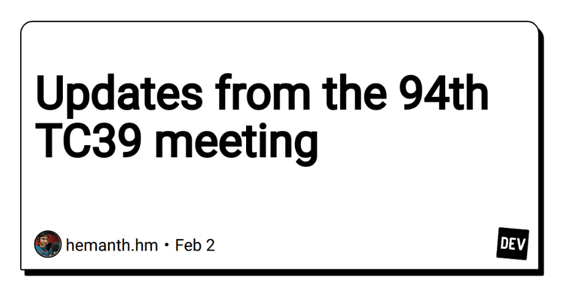

# Today we learned

# Interesting site and Link

## [Updates from the 94th TC39 meeting](https://dev.to/hemanth/updates-from-the-94th-tc39-meeting-48mb)

Functional proposals and the progress of the 94th TC39 meeting can be found.

Interesting suggestions

- [Change Array by Copy(stage4)](https://github.com/tc39/proposal-change-array-by-copy): Provides additional methods on Array.prototype and TypedArray.prototype to enable changes on the array by returning a new copy of it with the change.
- [Async Context(stage1)](https://github.com/tc39/proposal-async-context): proposal is to provide a mechanism to ergonomically track async contexts in JavaScript.

## [VS Code v1.75](https://code.visualstudio.com/updates/v1_75)

- [Profiles](https://code.visualstudio.com/updates/v1_75#_profiles): Create and share profiles to configure extensions, settings, shortcuts, and more. It would be useful to set up a profile according to the development language.
- [Easier multi-view resizing](https://code.visualstudio.com/updates/v1_75#_workbench): Drag layout corners to resize multiple views at once.
- [Code Action list is now scrollable](https://code.visualstudio.com/updates/v1_75#_code-action-list-is-now-scrollable): Some extensions generate long lists of Code Actions. If there is not space to render all Code Actions, you can now scroll through the list

## [Jumpy Extension for Visual Studio Code](https://marketplace.visualstudio.com/items?itemName=wmaurer.vscode-jumpy)

Jumpy provides fast cursor movement, inspired by Atom's package of the same name.

## [Perplexity](https://www.perplexity.ai)

It is similar to the chatGPT, but gives you a source.

## [Raycast](https://www.raycast.com/)

This is similar to [Alfred](https://www.alfredapp.com/).
It lets you complete tasks, calculate, share common links, and much more.
